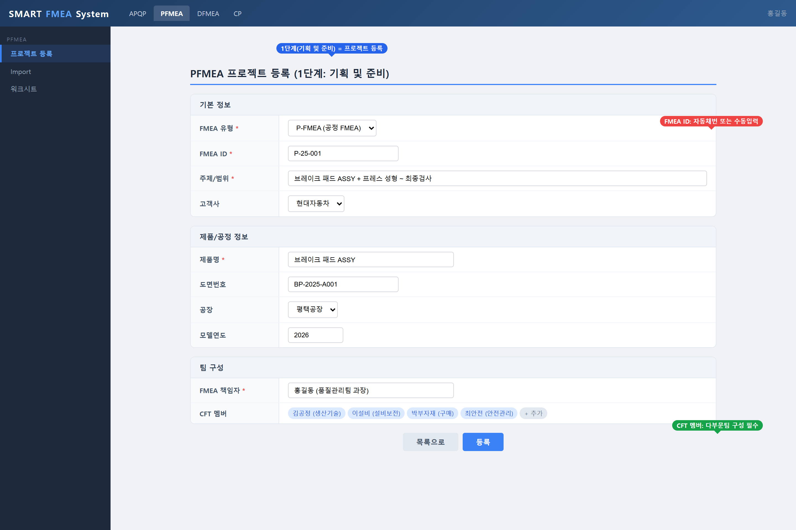
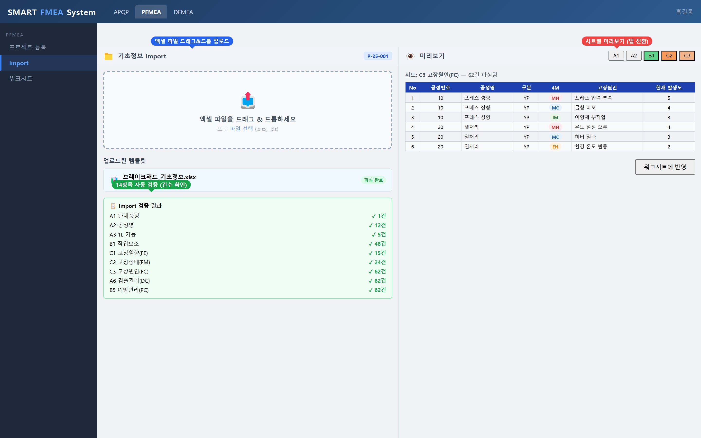
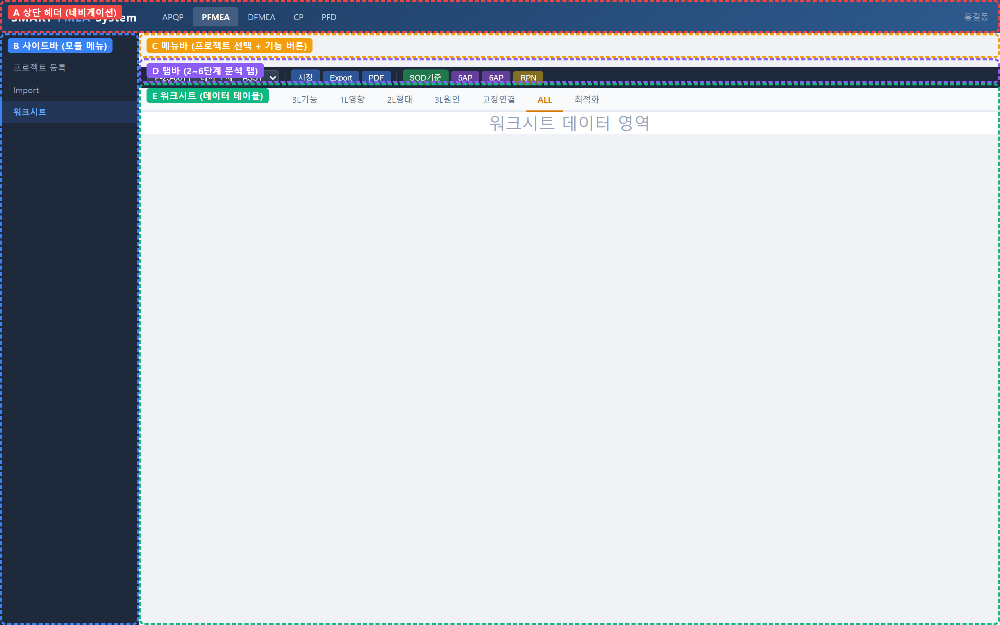
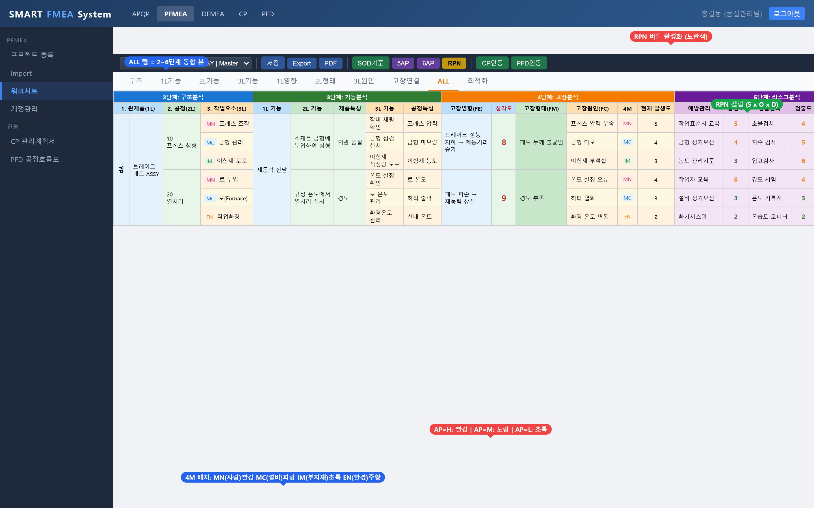

# SMART FMEA System 사용자 매뉴얼

> **버전**: 2.3.0
> **최종 업데이트**: 2026-03-02
> **시스템명**: FMEA On-Premise (Smart System)
> **기준**: AIAG-VDA FMEA Handbook (7단계 접근법)

---

## 목차

**Phase 1: 시스템 접속**
- [1. 시스템 개요](#1-시스템-개요)
- [2. 시스템 접속](#2-시스템-접속)
- [3. 회원가입](#3-회원가입)
- [4. 로그인](#4-로그인)
- [5. 웰컴보드 (메인화면)](#5-웰컴보드-메인화면)
- [6. 대시보드](#6-대시보드)

**Phase 2: PFMEA 프로젝트 등록**
- [7. PFMEA 프로젝트 등록](#7-pfmea-프로젝트-등록)
- [8. FMEA 유형 구조 (M/F/P)](#8-fmea-유형-구조-mfp)

**Phase 3: 기초정보 Import**
- [9. 기초정보 Import (엑셀)](#9-기초정보-import-엑셀)
  - [9.8 Import 오류 케이스](#98-import-오류-케이스)

**Phase 4: 워크시트 작업 (2~6단계)**
- [10. 워크시트 화면 구성](#10-워크시트-화면-구성)
- [11. 2단계: 구조분석](#11-2단계-구조분석)
  - [11.6 구조트리 검증 상태 (트리뷰 배지)](#116-구조트리-검증-상태-트리뷰-배지)
- [12. 3단계: 기능분석](#12-3단계-기능분석)
- [13. 4단계: 고장분석](#13-4단계-고장분석)
- [14. 고장연결](#14-고장연결)
  - [14.1 진입 조건](#141-진입-조건)
  - [14.2 화면 구성](#142-화면-구성)
  - [14.3 연결 방법](#143-연결-방법)
  - [14.4 고장사슬 다이어그램](#144-고장사슬-다이어그램)
  - [14.5 연결표(분석결과)](#145-연결표분석결과)
  - [14.6 전체확정](#146-전체확정)
  - [14.7 누락 경고](#147-누락-경고)
  - [14.8 연결해제 및 재확정](#148-연결해제-및-재확정)
  - [14.9 고장연결 용어 정리](#149-고장연결-용어-정리)
- [15. 5단계: 위험분석](#15-5단계-위험분석)
- [16. 6단계: 최적화](#16-6단계-최적화)
- [17. 전체보기 (ALL 탭)](#17-전체보기-all-탭)

**Phase 5: 연동 및 출력**
- [18. CP 연동 / PFD 연동](#18-cp-연동--pfd-연동)
- [19. PDF 출력 / Excel Export](#19-pdf-출력--excel-export)

**Phase 6: 관리**
- [20. 프로젝트 리스트](#20-프로젝트-리스트)
- [21. 개정관리 (Revision)](#21-개정관리-revision)
- [22. 확정/승인 프로세스](#22-확정승인-프로세스)
- [23. AP 개선관리](#23-ap-개선관리)
- [24. 습득교훈 (Lessons Learned)](#24-습득교훈-lessons-learned)

**Phase 7: DFMEA**
- [25. DFMEA 모듈](#25-dfmea-모듈)

**Phase 8: 부록**
- [26. 용어집](#26-용어집)
- [27. 문제 해결 가이드](#27-문제-해결-가이드)
- [28. 버전 이력](#28-버전-이력)

---

# Phase 1: 시스템 접속

## 1. 시스템 개요

### 1.1 Smart System이란?

Smart System은 AIAG-VDA FMEA Handbook의 7단계 접근법에 기반한 온프레미스(On-Premise) 품질관리 통합 시스템입니다. 설계 FMEA(DFMEA)와 공정 FMEA(PFMEA)를 중심으로, 관리계획서(CP), 공정흐름도(PFD), 작업표준(WS), 설비보전(PM) 모듈을 연동하여 자동차 산업의 APQP(Advanced Product Quality Planning) 활동을 지원합니다.

### 1.2 주요 모듈

| 모듈 | 정식명칭 | 설명 |
|------|----------|------|
| **PFMEA** | Process FMEA | 공정 고장모드 영향분석 - 제조 공정의 잠재적 고장을 분석 |
| **DFMEA** | Design FMEA | 설계 고장모드 영향분석 - 제품 설계 단계의 잠재적 고장을 분석 |
| **CP** | Control Plan | 관리계획서 - 공정 관리 방법을 문서화 |
| **PFD** | Process Flow Diagram | 공정흐름도 - 제조 공정 순서를 시각적으로 표현 |
| **WS** | Work Standard | 작업표준 - 작업 절차를 표준화 |
| **PM** | Preventive Maintenance | 설비보전 - 설비 유지보수 관리 |

### 1.3 FMEA 7단계 접근법

Smart System은 AIAG-VDA FMEA Handbook의 7단계를 기반으로 설계되었습니다.

| 단계 | 명칭 | 시스템 대응 |
|------|------|-----------|
| 1단계 | 기획 및 준비 (Planning & Preparation) | 프로젝트 등록 화면 |
| 2단계 | 구조분석 (Structure Analysis) | 워크시트 - 구조분석 탭 |
| 3단계 | 기능분석 (Function Analysis) | 워크시트 - 1L/2L/3L 기능 탭 |
| 4단계 | 고장분석 (Failure Analysis) | 워크시트 - 1L영향/2L형태/3L원인/고장연결 탭 |
| 5단계 | 위험분석 (Risk Analysis) | 워크시트 - ALL 탭 (SOD 평가, AP) |
| 6단계 | 최적화 (Optimization) | 워크시트 - ALL 탭 (개선활동) |
| 7단계 | 문서화 (Results Documentation) | PDF 출력, Excel Export, 확정/승인 |

### 1.4 시스템 요구사항

| 항목 | 요구사항 |
|------|----------|
| 브라우저 | Google Chrome, Microsoft Edge (최신 버전 권장) |
| 해상도 | 1366x768 이상 (1440x900 권장) |
| 배율 | 브라우저 100% 기준 최적화 |
| 네트워크 | 사내 네트워크 또는 VPN |

---

## 2. 시스템 접속

### 2.1 접속 URL

```
http://{서버주소}:3000
```

> **참고**: 실제 운영 환경에서는 서버 관리자가 제공하는 URL을 사용하세요. 개발 환경에서는 `http://localhost:3000`으로 접속합니다.

### 2.2 첫 접속 화면

시스템에 접속하면 **웰컴보드(Welcome Board)** 화면이 표시됩니다. 웰컴보드는 시스템의 메인 화면으로, 로그인 여부에 관계없이 접근할 수 있습니다.

> 📸 **[화면 캡처]** 웰컴보드 첫 접속 화면
>
> 

- 상단 좌측: Smart System 로고 및 시스템명
- 상단 우측: 로그인/회원가입 버튼 (미로그인 시) 또는 프로필 영역 (로그인 시)
- 중앙: 시스템 소개 배너 및 FMEA 대시보드 미리보기
- 하단: 바로가기 메뉴, MY JOB 현황, 관련 사이트 링크

---

## 3. 회원가입

### 3.1 회원가입 화면 접속

1. 웰컴보드 우측 상단의 **로그인** 링크 클릭
2. 로그인 화면 하단의 **회원가입** 링크 클릭
3. 또는 직접 URL 접속: `http://{서버주소}:3000/auth/register`

### 3.2 회원가입 화면 구성

> 📸 **[화면 캡처]** 회원가입 화면
>
> 

회원가입 화면은 가로 테이블 형식으로 구성되어 있으며, 다음 항목을 입력합니다.

### 3.3 프로필 사진 등록 (선택)

화면 상단에 프로필 사진 영역이 있습니다.

1. **사진 선택** 버튼 클릭
2. JPG 또는 PNG 파일 선택 (최대 10MB)
3. 이미지가 자동으로 150x150 크기로 리사이즈됨
4. 미리보기가 표시되면 확인
5. 사진 우측 상단의 **X** 버튼으로 제거 가능

### 3.4 기본 정보 입력

| 필드 | 설명 | 필수 | 예시 |
|------|------|:----:|------|
| 성명 | 본인 이름 | * | 홍길동 |
| 이메일 | 이메일 주소 (로그인 ID로 사용) | * | user@company.com |
| 전화번호 | 연락처 (최초 비밀번호로 사용) | * | 010-1234-5678 |
| 직급 | 직급 | | 과장 |
| 공장 | 소속 공장 | * | 평택공장 |
| 부서 | 소속 부서 | * | 품질관리 |

### 3.5 사용 모듈 선택

최소 1개 이상의 모듈을 선택해야 합니다.

| 모듈 | 설명 |
|------|------|
| PFMEA | 공정 FMEA (공정 고장모드 영향분석) |
| DFMEA | 설계 FMEA (설계 고장모드 영향분석) |
| CP | 관리계획서 (Control Plan) |
| PFD | 공정흐름도 (Process Flow Diagram) |

### 3.6 가입 절차

1. 모든 필수 정보(**\*** 표시) 입력
2. 사용할 모듈 체크박스 1개 이상 선택
3. **가입 신청** 버튼 클릭
4. "가입 신청 완료!" 메시지 확인
5. **관리자 승인 대기** (관리자가 승인해야 로그인 가능)

> **중요**: 최초 비밀번호는 등록한 **전화번호(숫자만)**입니다. 로그인 후 반드시 비밀번호를 변경하세요.

---

## 4. 로그인

### 4.1 로그인 화면 접속

1. 웰컴보드에서 우측 상단의 **로그인** 버튼 클릭
2. 또는 직접 URL 접속: `http://{서버주소}:3000/auth/login`

### 4.2 로그인 화면 구성

> 📸 **[화면 캡처]** 로그인 화면
>
> 

- 상단: 프로필 사진 등록 영역 (클릭하여 사진 업로드 가능)
- 중앙: 이메일/ID 입력, 비밀번호 입력
- 하단: 비밀번호 찾기, 비밀번호 변경, 회원가입 링크

### 4.3 로그인 방법

| 필드 | 입력값 |
|------|--------|
| 이메일 / ID | 등록한 이메일 또는 이름 |
| 비밀번호 | 설정한 비밀번호 (최초: 전화번호 숫자) |

1. **이메일 / ID** 입력
2. **비밀번호** 입력 (우측 눈 아이콘으로 비밀번호 표시/숨기기 전환 가능)
3. **로그인** 버튼 클릭
4. 로그인 성공 시 웰컴보드로 자동 이동

### 4.4 프로필 사진 등록 (로그인 화면)

로그인 화면 상단의 원형 영역을 클릭하면 프로필 사진을 업로드할 수 있습니다. 로그인 전에 사진을 등록하면, 로그인 시 자동으로 서버에 저장됩니다.

### 4.5 비밀번호 찾기

1. 로그인 화면 하단의 **비밀번호를 잊으셨나요?** 클릭
2. 비밀번호 찾기 모달에서 등록된 이메일 주소 입력
3. **이메일 발송** 버튼 클릭
4. 이메일로 비밀번호 재설정 링크 수신

### 4.6 비밀번호 변경

로그인 화면 하단의 **비밀번호 변경** 링크를 클릭하면 비밀번호 변경 화면(`/auth/change-password`)으로 이동합니다.

### 4.7 로그아웃

웰컴보드 우측 상단의 프로필 영역에서 로그아웃할 수 있습니다.

---

## 5. 웰컴보드 (메인화면)

### 5.1 화면 구성

로그인 후 표시되는 메인 화면입니다.

> 📸 **[화면 캡처]** 웰컴보드 메인 화면 (로그인 후)
>
> 

```
+------------------------------------------------------------------+
| [Smart System 로고]                          [프로필사진] 홍길동  |
+------------------------------------------------------------------+
|  +---------------------------+  +------------------------------+ |
|  | Welcome! Smart System!    |  | FMEA Dashboard Preview       | |
|  | Smart System으로           |  | (실시간 DB 통계)             | |
|  | 프리미엄 자동차 시장에     |  |                              | |
|  | 진출하세요!               |  |                              | |
|  +---------------------------+  +------------------------------+ |
|                                                                   |
|  MY JOB Status -- 나의 업무 현황                                  |
|  +----------+ +----------+ +----------+ +----------+             |
|  | 총 업무  | | 진행중   | | 완료     | | 지연     |             |
|  |    4     | |    1     | |    1     | |    1     |             |
|  +----------+ +----------+ +----------+ +----------+             |
|                                                                   |
|  바로가기 -- 홍길동님 환영합니다                                  |
|  +----------+ +----------+ +----------+ +----------+ +----------+|
|  | 대시보드 | | Top RPN  | | PFMEA    | | AP 개선  | | 습득교훈 ||
|  +----------+ +----------+ | 리스트   | | 관리     | |          ||
|  +----------+ +----------+ +----------+ +----------+ +----------+|
|  | DFMEA    | | CP       | | PFD      | | WS       | | PM       ||
|  +----------+ +----------+ +----------+ +----------+ +----------+|
|                                                                   |
|  관련 사이트                                                      |
|  AMP 시스템: ampbiz.co.kr | AMP 문의하기 | AMP 카페 | YouTube    |
|  관련기관: AIAG | VDA QMC | ISO | IATF Oversight                 |
+------------------------------------------------------------------+
```

### 5.2 MY JOB Status (업무 현황)

웰컴보드 중앙에 표시되는 업무 현황 카드입니다. 클릭하면 MY JOB 상세 화면(`/myjob`)으로 이동합니다.

| 항목 | 설명 | 색상 |
|------|------|------|
| 총 업무 | 사용자에게 할당된 전체 업무 수 | 파란색 |
| 진행중 | 현재 진행 중인 업무 | 초록색 |
| 완료 | 완료된 업무 | 노란색 |
| 지연 | 목표일을 초과한 업무 | 빨간색 |

### 5.3 바로가기 메뉴

| 메뉴 | 설명 | URL |
|------|------|-----|
| 대시보드 | PFMEA 대시보드 (현황 차트) | `/pfmea/dashboard` |
| Top RPN | RPN 상위 항목 분석 | `/rpn-analysis` |
| PFMEA 리스트 | PFMEA 프로젝트 목록 | `/pfmea/list` |
| AP 개선관리 | Action Priority 개선 활동 | `/pfmea/ap-improvement` |
| 습득교훈 | Lessons Learned 관리 | `/pfmea/lessons-learned` |
| DFMEA | DFMEA 프로젝트 목록 | `/dfmea/list` |
| CP | Control Plan 목록 | `/control-plan/list` |
| PFD | 공정흐름도 목록 | `/pfd/list` |
| WS | 작업표준 | `/ws` |
| PM | 설비보전 | `/pm` |

> **참고**: 로그인하지 않은 상태에서 바로가기를 클릭하면 로그인 화면으로 이동합니다.

### 5.4 프로필 관리

웰컴보드 우측 상단의 프로필 아바타를 클릭하면 프로필 사진 변경 메뉴가 나타납니다.

1. **파일에서 선택**: 새 프로필 사진 업로드
2. **사진 삭제**: 등록된 프로필 사진 제거

---

## 6. 대시보드

### 6.1 PFMEA 대시보드

웰컴보드에서 **대시보드** 바로가기를 클릭하거나, URL `http://{서버주소}:3000/pfmea/dashboard`로 접속합니다.

> 📸 **[화면 캡처]** PFMEA 대시보드 화면
>
> 

대시보드는 PFMEA 프로젝트의 전체 현황을 차트와 통계로 제공합니다.

| 영역 | 내용 |
|------|------|
| 통계 카드 | 총 프로젝트 수, 진행중, 완료, 지연 건수 |
| 단계별 진행률 | 1~7단계별 프로젝트 분포 (막대 차트) |
| 상태별 분포 | 완료/진행중/지연 비율 (원형 차트) |
| 최근 프로젝트 | 최근 수정된 프로젝트 목록 |

---

# Phase 2: PFMEA 프로젝트 등록

## 7. PFMEA 프로젝트 등록

### 7.1 등록 화면 접속

- 웰컴보드에서 **PFMEA 리스트** > 상단 **등록** 버튼 클릭
- 또는 직접 URL 접속: `http://{서버주소}:3000/pfmea/register`

### 7.2 등록 화면 구성

> 📸 **[화면 캡처]** PFMEA 등록 화면
>
> 

등록 화면은 다음 3개 영역으로 구성됩니다.

```
+------------------------------------------------------------------+
| [PFMEA 상단 네비게이션]                                           |
+------------------------------------------------------------------+
| PFMEA 등록                   [도움말] [+새로 작성] [편집] [저장]  |
+------------------------------------------------------------------+
| [기획 및 준비 (1단계)] -------------------------------- [도움말]  |
| +------+----------+------+----------+------+----------+------+--+|
| |FMEA  | M-Master | FMEA | 품명+   | FMEA | pfm26-  |상위  | -||
| |유형   | FMEA     | 명   | PFMEA   | ID   | m001    |APQP  |  ||
| +------+----------+------+----------+------+----------+------+--+|
| |공정  |          | FMEA |          |시작  |          |상위  |  ||
| |책임  |          | 담당자|          |일자  |          |FMEA  |  ||
| +------+----------+------+----------+------+----------+------+--+|
| |고객  |          |엔지니|          |목표  |          |연동  |  ||
| |명    |          |어링  |          |완료일|          |CP    |  ||
| +------+----------+------+----------+------+----------+------+--+|
| |회사  |          |모델  |          |품명  |          |연동  |  ||
| |명    |          |연식  |          |      |          |PFD   |  ||
| +------+----------+------+----------+------+----------+------+--+|
| |품번  |          |상호  |          |기밀  |          |연동  |  ||
| |      |          |기능팀|          |수준  |          |DFMEA |  ||
| +------+----------+------+----------+------+----------+------+--+|
+------------------------------------------------------------------+
| [FMEA 기초 정보등록] [Master BD 사용] [Family BD 사용] [Part BD] ||
+------------------------------------------------------------------+
| [CFT 리스트]                                                      |
+------------------------------------------------------------------+
| [CFT 접속 로그]                                                   |
+------------------------------------------------------------------+
```

### 7.3 기획 및 준비 (1단계) - 입력 필드

**1행: 기본 식별 정보**

| 필드 | 설명 | 입력 방법 |
|------|------|----------|
| **FMEA 유형** | M(Master) / F(Family) / P(Part) 선택 | 드롭다운 선택 |
| **FMEA명** | 프로젝트 이름 (시스템, 서브시스템 및/또는 구성품) | 직접 입력 |
| **FMEA ID** | 자동 생성되는 프로젝트 ID (예: pfm26-m001) | 자동 (클릭 시 리스트 이동) |
| **상위 APQP** | 연결할 APQP 프로젝트 | 준비중 |

**2행: 담당자 정보**

| 필드 | 설명 | 입력 방법 |
|------|------|----------|
| **공정 책임** | 공정 책임 부서 | 직접 입력 또는 검색(돋보기) 아이콘 클릭하여 사용자 선택 |
| **FMEA 담당자** | FMEA 작성 담당자 | 직접 입력 또는 검색 아이콘 클릭하여 사용자 선택 |
| **시작 일자** | 프로젝트 시작일 | 클릭하여 달력 모달에서 선택 |
| **상위 FMEA** | Master/Family FMEA 연결 | 클릭하여 FMEA 선택 모달에서 선택 |

**3행: 고객 및 일정 정보**

| 필드 | 설명 | 입력 방법 |
|------|------|----------|
| **고객명** | 고객사 정보 | 직접 입력 또는 검색 아이콘 클릭하여 고객정보 모달에서 선택 |
| **엔지니어링 위치** | 엔지니어링 담당 위치 (공장) | 직접 입력 |
| **목표 완료일** | 프로젝트 목표 완료일 | 클릭하여 달력 모달에서 선택 |
| **연동 CP** | 연동된 Control Plan | 자동 표시 (연동 설정 시) |

**4행: 제품 정보**

| 필드 | 설명 | 입력 방법 |
|------|------|----------|
| **회사명** | FMEA를 작성하는 회사 | 직접 입력 |
| **모델 연식** | 차종 연식 / 어플리케이션 | 직접 입력 |
| **품명** | 완제품명 | 직접 입력 |
| **연동 PFD** | 연동된 공정흐름도 | 자동 표시 (연동 설정 시) |

**5행: 추가 정보**

| 필드 | 설명 | 입력 방법 |
|------|------|----------|
| **품번** | 제품 품번 | 직접 입력 |
| **상호기능팀** | CFT 멤버 자동 표시 | 자동 (CFT 입력 기반) |
| **기밀수준** | 사업용도 / 독점 / 기밀 | 드롭다운 선택 |
| **연동 DFMEA** | 연동된 DFMEA | 자동 표시 |

> **중요**: **회사명**은 FMEA를 작성하는 회사, **고객명**은 고객사(납품 대상) 정보입니다. 서로 다른 개념이므로 혼동하지 않도록 주의하세요.

### 7.4 FMEA 기초 정보등록 옵션

등록 화면 중앙의 기초 정보등록 영역에서 기초정보 소스를 선택합니다.

| 옵션 | 색상 | 설명 | 사용 시점 |
|------|------|------|----------|
| **Master FMEA Basic Data 사용** | 보라색 | 마스터 FMEA 기초정보 복사 | Family 또는 Part 작성 시 |
| **Family FMEA Basic Data 사용** | 파란색 | 패밀리 FMEA 기초정보 복사 | Part 작성 시 |
| **Part FMEA Basic Data 사용** | 초록색 | 파트 FMEA 기초정보 복사 | 다른 Part 참조 시 |
| **신규 입력** | 황색 | Import 화면으로 이동 | 최초 Master 작성 시 |

- 미선택 상태: 연한 배경색에 아이콘 표시 (예: "Master FMEA Basic Data 사용")
- 선택 상태: 진한 배경색에 체크 표시 (예: "마스터 pfm26-m001 적용 (15건)")

### 7.5 CFT(Cross-Functional Team) 구성

등록 화면 하단의 CFT 리스트 테이블에서 팀 멤버를 등록합니다.

| 역할 | 설명 |
|------|------|
| Champion | 프로젝트 총괄 책임자 |
| Leader | 팀 리더 |
| PM | 프로젝트 매니저 |
| Moderator | 진행 조율자 |
| 팀원 | 참여 인원 (복수 가능) |

**CFT 멤버 추가 방법**:
1. 테이블의 빈 행에서 이름, 부서, 직급, 담당업무를 직접 입력
2. 또는 **검색 아이콘**(돋보기)을 클릭하여 등록된 사용자 검색/선택

### 7.6 저장

1. 모든 정보 입력 완료
2. 우측 상단의 **저장** 버튼 클릭
3. 버튼이 "저장됨"으로 변경되면 저장 완료

### 7.7 상단 버튼 기능

| 버튼 | 설명 |
|------|------|
| **도움말** | 등록화면 도움말 패널 토글 |
| **새로 작성** | 새로운 PFMEA 프로젝트 등록 시작 |
| **편집** | 기존 프로젝트 편집 모드 진입 |
| **저장** | 현재 데이터를 DB에 저장 |

---

## 8. FMEA 유형 구조 (M/F/P)

PFMEA와 DFMEA 모두 **M(Master) > F(Family) > P(Part)** 3단계 계층 구조를 사용합니다. 상위 FMEA의 기초정보(Basic Data)를 하위에서 상속받아 활용함으로써 일관성과 효율성을 확보합니다.

### 8.1 계층 구조 개요

```
+----------------------------------+
|  Master FMEA (MBD)               |  <-- 공정 유형별 표준 기준 문서
|  ID: PFM26-M001 / DFM26-M001    |
+----------------+-----------------+
                 |
+----------------v-----------------+
|  Family FMEA (FBD)               |  <-- Master를 상속한 제품군 단위
|  ID: PFM26-F001 / DFM26-F001    |
+----------------+-----------------+
                 |
+----------------v-----------------+
|  Part FMEA (PBD)                 |  <-- Family를 상속한 개별 부품 (양산)
|  ID: PFM26-P001 / DFM26-P001    |
+----------------------------------+
```

| 유형 | 약어 | 역할 | 적용 범위 |
|------|------|------|----------|
| **Master** | MBD (Master FMEA Basic Data) | 공정 유형별 표준 FMEA 기준 | 전 제품 공통 |
| **Family** | FBD (Family FMEA Basic Data) | 제품군 단위 FMEA | 동일 공정 공유 제품군 |
| **Part** | PBD (Part FMEA Basic Data) | 개별 부품/제품 FMEA | 실제 양산 적용 |

### 8.2 FMEA ID 체계

FMEA ID는 `{모듈}{년도}-{유형}{순번}` 형식으로 자동 생성됩니다.

| 모듈 | 유형 | ID 예시 | BD ID |
|------|------|---------|-------|
| PFMEA Master | M | PFM26-M001 | MBD-26-001 |
| PFMEA Family | F | PFM26-F001 | FBD-26-001 |
| PFMEA Part | P | PFM26-P001 | PBD-26-001 |
| DFMEA Master | M | DFM26-M001 | MBD-26-001 |
| DFMEA Family | F | DFM26-F001 | FBD-26-001 |
| DFMEA Part | P | DFM26-P001 | PBD-26-001 |

### 8.3 FMEA 선택 모달

등록 화면에서 상위 FMEA를 선택할 때 나타나는 모달입니다.

**모달 테이블 컬럼 구성 (7컬럼)**:

| 컬럼 | 설명 | 예시 |
|------|------|------|
| No | 순번 | 1, 2, 3... |
| 유형 | M/F/P 배지 + BD 약어 | `M MBD`, `F FBD`, `P PBD` |
| BD ID | 기초정보 ID | MBD-26-001 |
| 고객 | 고객사명 | 현대자동차 |
| FMEA ID | 프로젝트 ID | PFM26-M001 |
| FMEA명 | 프로젝트 제목 | 승용차 타이어 제조공정 PFMEA |
| 비고 | 비고/기밀수준 | 사업용도 |

### 8.4 산업 예시: 타이어 제조 (PFMEA)

다음은 타이어 제조 공장에서 M/F/P 구조를 적용하는 실제 예시입니다.

**Master FMEA (공정 유형별 표준)**

| 항목 | 내용 |
|------|------|
| FMEA ID | PFM26-M001 |
| BD ID | MBD-26-001 |
| FMEA명 | 타이어 제조공정 표준 PFMEA |
| 고객 | 일반 (전 고객 공통) |
| 적용 대상 | 전체 타이어 생산라인 공통 공정 |
| 포함 공정 | 배합 > 압출 > 재단 > 성형 > 가류 > 검사 |

> Master FMEA는 공정 유형에 대한 **표준 기준 문서**입니다. 모든 제품군에 공통으로 적용되는 공정, 고장모드, 관리방법을 정의합니다.

**Family FMEA (제품군 단위)**

| 항목 | Family 1 | Family 2 | Family 3 |
|------|----------|----------|----------|
| FMEA ID | PFM26-F001 | PFM26-F002 | PFM26-F003 |
| BD ID | FBD-26-001 | FBD-26-002 | FBD-26-003 |
| FMEA명 | 승용차용 타이어 PFMEA | 트럭버스용 타이어 PFMEA | 산업용 타이어 PFMEA |
| 고객 | 현대자동차 | 대형차량 OEM | 중장비 제조사 |
| 상위 FMEA | PFM26-M001 (Master) | PFM26-M001 (Master) | PFM26-M001 (Master) |
| 특화 공정 | 고속주행 밸런싱 공정 추가 | 하중내구 강화 가류 공정 | 내열/내마모 특수배합 공정 |

> Family FMEA는 Master를 상속받되, **제품군별 특화 공정과 고장모드**를 추가합니다.

**Part FMEA (개별 부품 -- 양산 적용)**

| 항목 | Part 1 | Part 2 | Part 3 |
|------|--------|--------|--------|
| FMEA ID | PFM26-P001 | PFM26-P002 | PFM26-P003 |
| BD ID | PBD-26-001 | PBD-26-002 | PBD-26-003 |
| FMEA명 | 소나타 26MY 타이어 | K5 26MY 타이어 | 그랜저 26MY 타이어 |
| 고객 | 현대자동차 | 기아 | 현대자동차 |
| 상위 FMEA | PFM26-F001 (승용차용) | PFM26-F001 (승용차용) | PFM26-F001 (승용차용) |
| 차종 규격 | 225/45R17 | 215/55R17 | 235/55R18 |

> Part FMEA는 Family를 상속받아 **실제 양산 차종/부품에 적용**하는 문서입니다. 고객사별 요구사항, 차종 규격 등 세부 정보가 추가됩니다.

### 8.5 상속 흐름 요약

```
Master (PFM26-M001)  "타이어 제조공정 표준"
  |
  +-- Family (PFM26-F001) "승용차용 타이어"
  |    +-- Part (PFM26-P001) "소나타 26MY 타이어"
  |    +-- Part (PFM26-P002) "K5 26MY 타이어"
  |    +-- Part (PFM26-P003) "그랜저 26MY 타이어"
  |
  +-- Family (PFM26-F002) "트럭버스용 타이어"
  |    +-- Part (PFM26-P010) "현대 트럭 12R22.5 타이어"
  |    +-- Part (PFM26-P011) "대우 버스 295/80R22.5 타이어"
  |
  +-- Family (PFM26-F003) "산업용 타이어"
       +-- Part (PFM26-P020) "지게차 28x9-15 타이어"
```

### 8.6 권장 워크플로우

1. **Master FMEA** 등록 > 엑셀 Import로 기초정보 입력 > 워크시트 작성
2. **Family FMEA** 등록 > "Master FMEA Basic Data 사용" 선택 > 제품군 특화 내용 추가
3. **Part FMEA** 등록 > "Family FMEA Basic Data 사용" 선택 > 차종별 세부 내용 추가

---

# Phase 3: 기초정보 Import

## 9. 기초정보 Import (엑셀)

### 9.1 Import 화면 접속 방법

- **등록 화면**: 기초 정보등록 영역에서 **신규 입력** 클릭
- **워크시트**: 탭 메뉴에서 **기초정보** 탭 클릭
- **직접 URL**: `http://{서버주소}:3000/pfmea/import?id=pfm26-m001`

### 9.2 Import 화면 구성

> 📸 **[화면 캡처]** 기초정보 Import 화면
>
> 

Import 화면은 **기초정보 템플릿 패널**과 **BD 현황 테이블**로 구성됩니다.

#### BD 현황 테이블 (Basic Data Status)

BD 현황 테이블은 등록된 모든 FMEA 프로젝트의 기초정보(Basic Data) 상태를 한눈에 보여줍니다.

| 컬럼 | 설명 |
|------|------|
| **유형** | FMEA 유형 — Master(M) / Family(F) / Part(P) |
| **회사명** | FMEA를 등록한 회사명 |
| **고객** | 고객사 (납품처) |
| **BD ID** | Basic Data 고유 ID (FMEA ID 기반 자동 생성, 예: MBD-26-001) |
| **FMEA ID** | FMEA 프로젝트 고유 ID (예: pfm26-m001) |
| **FMEA명** | FMEA 프로젝트 제목 |
| **Rev** | 개정번호 (Revision) |
| **작성일** | FMEA 프로젝트 작성일 |
| **BD생성** | 기초정보가 DB에 최초 저장된 날짜 (Import 시점) |
| **공정/요소** | PFMEA: 공정갯수 / DFMEA: 초점요소 갯수 |
| **데이터** | 기초정보 데이터 건수 (값이 있는 항목 수) |
| **판정** | 적합(공정/요소+데이터 모두 있음) / 누락(없음) |

> **참고**: 컬럼 헤더를 클릭하면 해당 컬럼 기준으로 정렬할 수 있습니다. 검색창에서 FMEA ID, FMEA명, 회사명, 고객, BD ID로 검색 가능합니다.

#### 기초정보 템플릿 — 3가지 모드

기초정보 데이터를 생성/편집하는 3가지 모드를 제공합니다.

| 모드 | L3 표시 | 설명 |
|------|---------|------|
| **기존 데이터** | 4M + 작업요소 | DB에 저장된 기초정보를 미리보기/편집 |
| **수동 템플릿** | 4M만 | 공정수/4M 설정 → 구조 생성 (작업요소는 편집으로 입력) |
| **자동 템플릿** | 4M + 작업요소 | 작업요소 입력 → B1 자동 완성 |

> **수동 vs 자동 차이점**:
> - 수동: 4M 구조만 생성 → 사용자가 직접 작업요소(B1) 입력
> - 자동: 작업요소 이름까지 입력 → B1 데이터 자동 완성

### 9.3 Import 절차

#### 1단계: 엑셀 양식 다운로드

액션 바에서 엑셀 양식을 다운로드합니다.

| 버튼 | 설명 |
|------|------|
| **샘플Down** | 예시 데이터가 포함된 엑셀 양식 다운로드 |
| **빈 양식** | 빈 엑셀 양식 다운로드 |

#### 2단계: 엑셀 데이터 입력

다운로드한 양식에 기초정보를 입력합니다. 엑셀 양식은 다음 아이템코드(Item Code) 체계를 따릅니다.

**L2 레벨 (공정 단위) 아이템코드**:

| 코드 | 항목 | 설명 |
|------|------|------|
| A1 | 공정번호 | 공정 순번 (10, 20, 30...) |
| A2 | 공정명 | 메인 공정 이름 |
| A3 | 공정 기능 | 공정의 기능 설명 |
| A4 | 공정 요구사항 | 공정 요구사항/특성 |
| A5 | 고장형태 | 공정 수준 고장 형태(FM) |
| A6 | 검출관리 | 현재 검출 관리 방법(DC) |

**L3 레벨 (작업요소 단위) 아이템코드**:

| 코드 | 항목 | 설명 |
|------|------|------|
| B1 | 작업요소명 | 세부 작업 요소 이름 |
| B2 | 작업요소 기능 | 작업요소의 기능 설명 |
| B3 | 부품특성 | 부품/공정 특성 |
| B4 | 고장원인 | 작업요소 수준 고장 원인(FC) |
| B5 | 예방관리 | 현재 예방 관리 방법(PC) |

> **참고**: B6은 PFMEA에 존재하지 않습니다 (CP에서만 사용: 샘플크기).

#### 3단계: 엑셀 파일 업로드

1. **Import 입력** 영역에서 **파일 선택** 버튼 클릭
2. 작성한 엑셀 파일(.xlsx, .xls) 선택
3. 파싱이 완료되면 데이터 건수 표시
4. **Import** 버튼 클릭하여 데이터 적용

#### 4단계: 미리보기 확인 및 편집

Import된 데이터는 **미리보기 패널**에 표시됩니다.

| 기능 | 설명 |
|------|------|
| 아이템코드 탭 | A2/A3/A4/A5/A6/B1/B2/B3/B4/B5별 데이터 조회 |
| 셀 편집 | 셀을 직접 클릭하여 값 수정 |
| 4M 변경 | B1~B4 항목의 4M 분류(MN/MC/IM/EN) 드롭다운 변경 |
| 행 삭제 | 선택한 행 삭제 |
| 드래그 정렬 | 행 순서 변경 |

#### 5단계: 저장

**저장** 버튼을 클릭하여 DB에 저장합니다. 저장 후 상단의 **워크시트 이동** 버튼이 활성화됩니다.

### 9.4 부분 Import

기존 데이터에 특정 아이템코드의 데이터만 추가할 때 사용합니다.

1. **부분 Import** 영역에서 아이템코드 선택 (예: A3)
2. 파일 선택 후 Import
3. 해당 아이템코드의 데이터만 추가/교체

### 9.5 분석 관계 패널

우측의 **분석 관계 패널**에서는 Import된 데이터의 관계를 확인합니다.

| 탭 | 분석 내용 |
|----|----------|
| A (구조분석) | 공정번호-공정명-작업요소 구조 |
| B (기능분석) | 기능-요구사항-특성 관계 |
| C (고장분석) | 고장형태-고장원인-고장영향 관계 |

### 9.6 워크시트 이동

Import 및 저장이 완료되면 미리보기 패널 상단의 **워크시트 이동** 버튼을 클릭하여 워크시트로 이동합니다. 이동 시 구조분석(L2/L3) 데이터가 자동으로 로드됩니다.

### 9.7 4M 분류 규칙

작업요소(B1~B4)에는 4M 분류가 적용됩니다.

| 코드 | 분류 | 설명 | 예시 |
|------|------|------|------|
| MN | Man (사람) | 작업자 관련 | 작업자 숙련도, 교육 |
| MC | Machine (설비/금형/지그) | 설비 관련 | 프레스기, 금형, 지그 |
| IM | Indirect Material (부자재) | 생산 보조재료 | 그리스, 윤활유, 세척액, 접착제 |
| EN | Environment (환경) | 작업 환경 | 온도, 습도, 조명 |

> **참고**: IM(부자재)은 최종 제품의 일부가 아닌 보조재료를 의미합니다. 도장도료 등 원자재는 IM이 아닙니다.

### 9.8 Import 오류 케이스

Import 미리보기 단계에서 발생할 수 있는 주요 오류 유형과 해결 방법입니다.

#### 오류 1: IM 원자재 분류 오류

| 항목 | 내용 |
|------|------|
| **증상** | Import 미리보기 헤더에 "오류 N" 빨간 배지 표시 |
| **원인** | 4M이 IM(부자재)인데 값이 원자재(도료, 도장, 페인트 등)인 항목이 포함됨 |
| **해결** | Import 화면에서 해당 항목의 4M 분류를 수정하거나 해당 항목 삭제 |

**IM 판별 기준**: "최종 제품의 일부인가?"
- YES → 원자재 (IM 아님, 해당 작업요소를 IM으로 분류하면 오류)
- NO → 부자재 (IM 정상)

**IM 블랙리스트** (원자재로 간주, IM으로 분류 시 오류 처리):

| 키워드 | 설명 |
|--------|------|
| 도료, 도장, 페인트 | 제품 표면에 남아 최종 제품의 일부가 됨 |
| 프라이머, 클리어코트 | 제품 도장 공정의 원자재 |
| 코팅제 | 제품 표면 처리 원자재 |

> **참고**: 그리스, 윤활유, 세척액, 접착제, 충격방지패드 등은 IM(부자재) 정상입니다.

#### 오류 2: 아이템코드 누락

| 항목 | 내용 |
|------|------|
| **증상** | Import 후 일부 데이터가 워크시트에 표시되지 않음 |
| **원인** | 엑셀 파일에 아이템코드(A1~A6, B1~B5) 컬럼이 누락되었거나 값이 비어 있음 |
| **해결** | 샘플 양식을 다운로드하여 아이템코드 컬럼 구조를 확인 후 재작성 |

> **참고**: PFMEA 아이템코드 체계 — L2 레벨: A1~A6(A6=검출관리), L3 레벨: B1~B5(B5=예방관리). B6은 PFMEA에 존재하지 않습니다(CP 전용).

#### 오류 3: 4M 분류 규칙 위반

| 항목 | 내용 |
|------|------|
| **증상** | 4M 컬럼에 빈값 또는 MN/MC/IM/EN 외의 값이 있는 행이 경고 표시됨 |
| **원인** | B1 작업요소의 4M이 허용값(MN/MC/IM/EN) 이외의 값으로 입력됨 |
| **해결** | MD/JG 값은 MC로 자동 변환됨. 그 외 값은 Import 화면에서 수동 수정 필요 |

---

# Phase 4: 워크시트 작업 (2~6단계)

## 10. 워크시트 화면 구성

### 10.1 워크시트 접속

- PFMEA 리스트에서 **FMEA명** 클릭
- 또는 URL: `http://{서버주소}:3000/pfmea/worksheet?id=pfm26-m001`

### 10.2 화면 레이아웃

> 📸 **[화면 캡처]** 워크시트 전체 화면
>
> 

```
+------------------------------------------------------------------+
| [공통 상단 네비] 홈|DFMEA|PFMEA|PFD|CP     사용자명 [ADMIN] 로그아웃 |  <-- 1행: 상단 네비
+------------------------------------------------------------------+
| [메뉴바] PFMEA: [FMEA선택] 저장됨 Import Export 특별특성 SOD ... |  <-- 2행: 툴바
+------------------------------------------------------------------+
| [탭 메뉴] 기초정보 | 구조분석 | 1L기능 | 2L기능 | 3L기능 | ...  |  <-- 3행: 탭 메뉴
+------------------------------------------------------------------+
|                                                |                  |
|  [워크시트 테이블 영역]                        | [우측 패널]      |
|  - 선택한 탭의 데이터 테이블                   | - 트리뷰         |
|  - 셀 편집, 행 추가/삭제                       | - 5AP/6AP 테이블 |
|  - 스크롤                                      | - RPN 차트       |
|                                                | - 고장사슬       |
+------------------------------------------------------------------+
```

### 10.3 메인 메뉴 (1행: 상단 네비게이션)

| 메뉴 | 설명 |
|------|------|
| 홈 | 웰컴보드(메인화면)로 이동 |
| DFMEA | DFMEA 모듈로 이동 |
| PFMEA | PFMEA 모듈로 이동 |
| PFD | 공정흐름도 모듈로 이동 |
| CP | 관리계획서 모듈로 이동 |
| 사용자 정보 | 현재 로그인 사용자 표시 |
| 로그아웃 | 세션 종료 |

### 10.4 툴바 (2행: 메뉴바)

> 📸 **[화면 캡처]** 워크시트 툴바 (2행)
>
> 

| 버튼 | 설명 |
|------|------|
| **PFMEA: [FMEA 선택]** | 현재 작업 중인 FMEA 프로젝트 선택/변경 (드롭다운) |
| **저장됨** / **저장** | 현재 저장 상태 표시 / 수동 저장 |
| **Import** | 엑셀 Import 메뉴 (파일 업로드, 양식 다운로드) |
| **Export** | 현재 탭의 데이터를 엑셀로 내보내기 |
| **특별특성** | 특별특성(SC/CC) 마스터 관리 모달 |
| **SOD** | Severity/Occurrence/Detection 평가 기준표 모달 |
| **5AP** | 5단계 Action Priority 기준표 (우측 패널) |
| **6AP** | 6단계 Action Priority 기준표 (우측 패널) |
| **RPN** | RPN(Risk Priority Number) 차트 (우측 패널) |
| **고장사슬** | 고장모드-영향-원인 연결 시각화 (우측 패널) |
| **PDF** | 워크시트 PDF 출력 뷰어 (우측 패널) |
| **CP연동** | Control Plan 연동 (구조 동기화, 데이터 동기화, CP 생성) |
| **PFD연동** | PFD 생성/연동 |
| **4판연동** | AIAG-VDA FMEA 4판 연동 |
| **CP이동** | 연동된 CP 워크시트로 이동 |
| **PFD이동** | 연동된 PFD 워크시트로 이동 |

### 10.5 탭 메뉴 (3행) -- 약어 해설

탭 메뉴는 FMEA 7단계 중 2~6단계 작업에 해당하는 탭들로 구성됩니다.

| 탭 이름 | 약어 풀이 | FMEA 단계 | 설명 |
|---------|----------|----------|------|
| **기초정보** | -- | 1단계 | Import 화면으로 이동 (기초정보 편집) |
| **구조분석** | -- | 2단계 | L1/L2/L3 공정 구조 편집 |
| **1L기능** | 1L = Level 1 | 3단계 | 완제품(L1) 기능 정의 |
| **2L기능** | 2L = Level 2 | 3단계 | 공정(L2) 기능 정의 |
| **3L기능** | 3L = Level 3 | 3단계 | 작업요소(L3) 기능 정의 |
| **1L영향** | 1L = Level 1 | 4단계 | 완제품 수준 고장 영향(FE) |
| **2L형태** | 2L = Level 2 | 4단계 | 공정 수준 고장 형태/모드(FM) |
| **3L원인** | 3L = Level 3 | 4단계 | 작업요소 수준 고장 원인(FC) |
| **고장연결** | -- | 4단계 | FM-FE-FC 고장 연결 관계 설정 |

탭 메뉴 오른쪽에는 **단계별 토글 버튼**이 있습니다.

| 토글 | 약어 풀이 | 설명 |
|------|----------|------|
| **2ST** | 2 Step = 2단계 | 구조분석 전체 열 표시 |
| **3ST** | 3 Step = 3단계 | 기능분석 전체 열 표시 |
| **4ST** | 4 Step = 4단계 | 고장분석 전체 열 표시 |
| **5ST** | 5 Step = 5단계 | 위험분석 전체 열 표시 |
| **6ST** | 6 Step = 6단계 | 최적화 전체 열 표시 |
| **ALL** | -- | 전체 단계 통합 보기 (40열) |
| **확정** | -- | 워크시트 확정 (잠금) |
| **승인** | -- | 개정관리 화면으로 이동하여 승인 프로세스 시작 |

> **참고**: AIAG-VDA FMEA Handbook 7단계 중 1단계(기획 및 준비)는 등록 화면에서 처리하며, 워크시트에서는 2~6단계를 다룹니다. 7단계(문서화)는 PDF 출력 및 확정/승인으로 대응합니다.

### 10.6 우측 패널

워크시트의 우측 350px 영역에는 보조 패널이 표시됩니다.

| 패널 | 표시 조건 | 내용 |
|------|----------|------|
| **트리뷰** | 구조분석~3L원인 탭 (기본) | L1/L2/L3 공정 구조 트리 |
| **5AP** | 툴바 5AP 버튼 클릭 시 | 5단계 Action Priority 평가표 |
| **6AP** | 툴바 6AP 버튼 클릭 시 | 6단계 Action Priority 평가표 |
| **RPN** | 툴바 RPN 버튼 클릭 시 | RPN 차트 |
| **고장사슬** | 툴바 고장사슬 버튼 클릭 시 | 고장 연결 시각화 |
| **PDF** | 툴바 PDF 버튼 클릭 시 | PDF 출력 미리보기 |
| (없음) | ALL 탭, 고장연결 탭 | 전체화면 (패널 숨김) |

### 10.7 입력 모드 (자동/수동)

워크시트는 두 가지 입력 모드를 지원합니다.

| 모드 | 설명 |
|------|------|
| **자동 모드** (기본) | 기초정보에서 Import한 마스터 데이터를 기반으로 모달 선택 방식 입력 |
| **수동 모드** | 셀 직접 입력 + 우클릭 컨텍스트 메뉴로 행 추가/삭제/병합 |

> 자동/수동 모드 전환은 구조분석 탭 헤더에서 가능합니다.

### 10.8 셀 편집 방법

**인라인 편집**:
1. 셀 **더블클릭**
2. 텍스트 입력/수정
3. **Enter** 키 또는 다른 셀 클릭하여 저장

**모달 선택** (자동 모드):
- 특정 셀(공정명, 작업요소명, 타입 등)은 클릭 시 선택 모달 표시
- 모달에서 항목을 선택하면 자동 입력

### 10.9 셀 텍스트 자동 축소 (adaptiveText)

구조분석 탭의 공정명/작업요소명 셀에서는 텍스트 길이에 따라 **자동으로 글씨 크기가 조절**됩니다. 잘림(말줄임) 없이 모든 텍스트가 항상 표시됩니다.

| 단계 | 텍스트 길이 | 글씨 크기 | 표시 방식 |
|------|-----------|----------|----------|
| 1단계 | 짧은 텍스트 | 11px (기본) | 한 줄 |
| 2단계 | 중간 텍스트 | 11px (기본) | 두 줄 줄바꿈 |
| 3단계 | 긴 텍스트 | 9px (축소) | 세 줄 줄바꿈 |
| 4단계 | 매우 긴 텍스트 | 8px (최소) | 전체 표시 |

---

## 11. 2단계: 구조분석

구조분석은 제조 공정의 계층적 구조를 정의하는 단계입니다.

### 11.1 PFMEA 3레벨 구조

```
L1 (Level 1): 완제품 제조라인
  +-- L2 (Level 2): 메인 공정
       +-- L3 (Level 3): 작업요소
```

| 레벨 | PFMEA 용어 | DFMEA 용어 | 설명 |
|------|-----------|-----------|------|
| L1 | 완제품 제조라인 | 다음상위수준 | 전체 제품/시스템 |
| L2 | 메인 공정명 | 초점요소 | 주요 공정 또는 A'SSY |
| L3 | 작업요소명 | 다음하위수준 | 세부 작업 또는 부품/특성 |

### 11.2 구조분석 탭 화면

> 📸 **[화면 캡처]** 구조분석 탭 화면 (헤더 + 테이블)
>
> 

**탭 헤더 표시 정보**:

구조분석 탭 상단에는 현재 데이터 현황이 괄호 안 숫자로 표시됩니다.

| 표시 | 의미 | 예시 |
|------|------|------|
| 완제품 공정명**(1)** | 등록된 완제품(L1) 수 | 1개의 완제품 라인 |
| 공정NO+공정명**(7)** | 등록된 메인 공정(L2) 수 | 7개 공정 등록됨 |
| 작업요소**(40)** | 등록된 작업요소(L3) 수 | 40개 작업요소 등록됨 |
| **수동/자동** | 현재 입력 모드 | 수동 모드 / 자동 모드 |
| **미확정** (노란색) | 아직 확정하지 않은 상태 | 확정 전 상태 |
| **누락 0건** (초록색) | 미입력 항목 수 | 0건이면 모두 입력 완료 |

**테이블 컬럼**:

| 컬럼 | 설명 |
|------|------|
| 완제품 제조라인 (L1) | 생산 라인명 (예: 타이어 제조라인) |
| 공정번호 | 공정 순번 (10, 20, 30...) |
| 공정명 (L2) | 메인 공정 이름 (예: 10 배합) |
| 4M | 작업요소의 4M 분류 (MN/MC/IM/EN) |
| 작업요소명 (L3) | 세부 작업 요소 (예: 배합기 온도 설정) |

### 11.3 L1 완제품 공정명 규칙

L1(완제품 제조라인) 셀에는 **품명 + "생산공정"** 형식으로 표시됩니다.

| 항목 | 내용 |
|------|------|
| 구성 | `{등록 화면의 품명}` + `생산공정` (접미사 고정) |
| 예시 | **E-Bike Motor Controller IC** 생산공정 |
| 표시 | 품명은 1행, "생산공정"은 2행으로 자동 줄바꿈 |
| 수정 | 셀을 더블클릭하여 직접 수정 가능 |

> 품명은 등록 화면에서 입력한 **품명** 필드에서 자동으로 가져옵니다.

### 11.4 데이터 입력 (자동 모드)

1. **L1 완제품명**: 등록 화면의 품명에서 자동 채움. 직접 수정 가능.
2. **L2 공정명**: 셀 클릭 > 공정 선택 모달에서 선택 또는 직접 입력
3. **L3 작업요소명**: 셀 클릭 > 작업요소 선택 모달에서 선택 또는 직접 입력
4. **4M 분류**: 작업요소 선택 시 자동 설정. 드롭다운으로 변경 가능.

### 11.5 데이터 입력 (수동 모드)

수동 모드에서는 셀을 직접 클릭하여 입력하고, 우클릭 컨텍스트 메뉴로 행을 추가/삭제합니다.

| 메뉴 항목 | 설명 |
|----------|------|
| 위로 행 추가 | 현재 행 위에 새 행 추가 |
| 아래로 행 추가 | 현재 행 아래에 새 행 추가 |
| 행 삭제 | 현재 행 삭제 |
| 위 행과 병합 | L1/L2/L3 셀 병합 |
| 아래 행과 병합 | L1/L2/L3 셀 병합 |
| 병합 해제 | 병합된 셀 분리 |
| 행 복사 | 현재 행 복사 |
| 행 붙여넣기 | 복사한 행 붙여넣기 |

### 11.6 구조트리 검증 상태 (트리뷰 배지)

구조분석 탭 우측 패널의 **트리뷰**에서는 각 작업요소(L3)의 검증 상태를 배지(badge)로 표시합니다.

| 상태 | 표시 | 설명 | 조치 방법 |
|------|------|------|----------|
| **정상** | 녹색 배너, "정상확인(자동모드)" 버튼 활성화 | 모든 작업요소가 오류 없이 정상 | 자동모드 버튼 클릭으로 자동매핑 진행 |
| **이상** | 빨간색 배경, "이상 N" 빨간 배지 | IM 원자재 오류가 있는 작업요소 존재 | Import 화면에서 4M 분류 수정 후 재등록 |
| **누락** | "누락 N" 빨간 배지 | 기초정보(마스터)에는 있으나 워크시트에 없는 작업요소 | 구조분석 탭에서 해당 작업요소 행 추가 |
| **신규** | 노란 배경, "신규 N" 노란 배지 | 새로 추가된 행(이름 미입력 상태) | 작업요소명 입력 후 저장 |

> **중요**: "이상" 또는 "누락" 배지가 있으면 자동모드 버튼이 비활성화됩니다. 모든 오류를 해결한 후 "정상확인(자동모드)" 버튼을 클릭하여 자동매핑을 시작하세요.

---

## 12. 3단계: 기능분석

기능분석은 각 레벨(L1/L2/L3)의 기능과 요구사항을 정의하는 단계입니다.

### 12.1 1L기능 (Level 1 기능)

**완제품(L1) 수준의 기능을 정의합니다.**

| 컬럼 | 설명 |
|------|------|
| 완제품 제조라인 | L1 구조 (읽기 전용) |
| 구분 | 고장영향 범위 (YP: Your Plant, 자기회사 공장 / SP: Ship to Plant, 상위고객 / USER: 자동차 사용자) |
| 완제품 기능 | 완제품의 기능 설명 |
| 요구사항 | 기능에 대한 요구사항/사양 |

### 12.2 2L기능 (Level 2 기능)

**공정(L2) 수준의 기능을 정의합니다.**

| 컬럼 | 설명 |
|------|------|
| 공정번호 | 공정 순번 |
| 공정명 | L2 구조 (읽기 전용) |
| 구분 | 기능 구분 |
| 공정 기능 | 공정의 기능 설명 |
| 특성 | 공정 특성/요구사항 |

### 12.3 3L기능 (Level 3 기능)

**작업요소(L3) 수준의 기능을 정의합니다.**

| 컬럼 | 설명 |
|------|------|
| 작업요소명 | L3 구조 (읽기 전용) |
| 4M | 4M 분류 |
| 구분 | 기능 구분 |
| 부품 기능 | 작업요소의 기능 설명 |
| 특성 | 부품/공정 특성 |

### 12.4 자동매핑 검증 시스템 (Gatekeeper)

자동 모드에서 마스터 기초정보를 워크시트에 매핑할 때, **문지기(Gatekeeper) 검증**을 거칩니다. 구조분석에서 확정된 공정/작업요소 구조는 **절대 변경되지 않으며**, 데이터만 기존 구조에 추가됩니다.

#### 자동매핑 흐름

```
1. "자동" 버튼 클릭 → 마스터 데이터 로드
2. ★ Gatekeeper 검증 (공정번호, 4M, itemCode 매칭)
3. 트리뷰 미리보기 모달 표시 (매칭/누락/거부 확인)
4. 사용자 확인 후 매핑 적용
```

#### 검증 결과 유형

| 결과 | 아이콘 | 설명 | 사용자 액션 |
|------|--------|------|------------|
| 정상 매칭 | O (녹색) | 마스터 데이터가 구조와 일치 | "진행" 클릭 |
| 데이터 누락 | X (적색) | 해당 공정/작업요소에 마스터 데이터 없음 | 수동 입력 또는 "빈 데이터 생성 후 진행" |
| 비정상 거부 | (주황) | 공정번호/4M 불일치 등 | 기초정보 수정 후 재시도 |

#### 트리뷰 미리보기 시뮬레이션 결과

**시나리오 1: 정상 데이터 (모든 매칭 성공)**

```
3L 기능분석 자동매핑 미리보기
매칭: 11건

▶ 10. 절단(컷팅)
   O MC 절단기(밴드소/레이저/워터젯)           B2×1, B3×2
   O MC 절삭공구(톱날/비트)                    B2×1
   O MN 작업자                                B2×1, B3×1
   O EN 작업장 온도/습도/조도/환기 환경         B2×1, B3×1
▶ 20. 성형/가공
   O MC 프레스/벤더                            B2×1, B3×2
▶ 30. 용접/접합
   O MC 용접기(TIG/MIG/레이저)                 B2×1, B3×4
   O MC 용접 지그/고정구                       B2×1
   O IM 용접 소모품(봉/와이어/가스)            B2×1, B3×1
```

**시나리오 2: 누락 혼합 (일부 매칭 + 일부 누락)**

```
3L 기능분석 자동매핑 미리보기
매칭: 5건 | 누락: 6건

▶ 10. 절단(컷팅)
   O MC 절단기(밴드소/레이저/워터젯)           B2×1, B3×1
   O MC 절삭공구(톱날/비트)                    B2×1
   X MN 작업자                                [데이타 누락]
   X EN 작업장 온도/습도/조도                  [데이타 누락]
▶ 40. 열처리
   X MC 열처리로                              [데이타 누락]
▶ 50. 표면처리/도장
   X MC 도장설비                              [데이타 누락]
```

**시나리오 3: 비정상 데이터 (일부 거부)**

```
3L 기능분석 자동매핑 미리보기
매칭: 8건 | 누락: 2건 | 거부: 7건

▶ 10. 절단(컷팅)
   O MC 절단기                                B2×1
   X MC 절삭공구                              [데이타 누락]
   O MN 작업자                                B2×2
▶ 20. 성형/가공
   O MC 프레스/벤더                            B2×1, B3×1

거부된 데이터:
  [구조에 없는 공정번호] 3건
   - "99" (유령설비)
   - "" (공정번호 누락)
   - "삼십" (한글 공정번호)
  [4M 불일치/누락] 2건
   - 공정 "20" 4M "XX"
   - 공정 "20" 4M 누락
  [빈 값] 1건
  [연쇄 삭제] 1건
```

**시나리오 4: 전체 실패 (자동매핑 거부)**

```
3L 기능분석 자동매핑 미리보기
매칭: 0건 | 거부: 5건

❌ 자동매핑 불가!
마스터 데이터가 현재 구조와 일치하지 않습니다.
수동 모드로 직접 입력해주세요.
```

#### 거부 사유 상세

| 거부 사유 | 설명 | 원인 | 해결 방법 |
|----------|------|------|----------|
| 구조에 없는 공정번호 | 마스터 데이터의 공정번호가 워크시트 구조에 없음 | 잘못된 공정번호 입력 | 기초정보 엑셀에서 공정번호 수정 후 재Import |
| 4M 불일치/누락 | 작업요소의 4M 코드가 구조와 다르거나 누락 | 잘못된 4M 코드(XX 등) | 기초정보에서 MN/MC/IM/EN으로 수정 |
| itemCode 불일치 | 허용되지 않는 데이터 유형 코드 | 잘못된 시트 배치 | 기초정보 엑셀 시트 확인 |
| FMEA ID 불일치 | 다른 FMEA 프로젝트의 데이터 | 마스터 데이터 선택 오류 | 올바른 마스터 FMEA 선택 |
| 빈 값 | 데이터 값이 비어있음 | 엑셀 셀 미입력 | 기초정보에 값 입력 |
| 연쇄 삭제 | 같은 공정+4M 그룹의 다른 항목이 비정상 | 그룹 내 오류 전파 | 해당 그룹 전체 수정 |

> **참고**: 비정상 데이터가 발견되면 같은 공정번호+4M 그룹의 모든 데이터가 **연쇄 삭제**됩니다. 해당 위치는 [데이타 누락]으로 표시되며, 사용자가 수동으로 올바른 데이터를 입력해야 합니다.

---

## 13. 4단계: 고장분석

고장분석은 각 레벨에서 발생할 수 있는 고장을 정의하는 단계입니다.

### 13.1 1L영향 (Level 1 고장 영향)

**완제품 수준의 고장 영향(Failure Effect, FE)을 정의합니다.**

| 컬럼 | 설명 |
|------|------|
| 완제품 기능 | 기능분석에서 정의한 기능 (읽기 전용) |
| 요구사항 | 기능 요구사항 (읽기 전용) |
| 고장 영향 (FE) | 고장이 최종 사용자/차량에 미치는 영향 |
| 심각도 (S) | 고장 영향의 심각도 등급 (1-10) |

### 13.2 2L형태 (Level 2 고장 형태)

**공정 수준의 고장 형태/모드(Failure Mode, FM)를 정의합니다.**

| 컬럼 | 설명 |
|------|------|
| 공정 기능 | 기능분석에서 정의한 기능 (읽기 전용) |
| 특성 | 공정 특성 (읽기 전용) |
| 고장 형태 (FM) | 기능 요구사항 미달에 대한 고장 서술 |
| 특별특성 | S(Safety)/C(Critical) 지정 |

### 13.3 3L원인 (Level 3 고장 원인)

**작업요소 수준의 고장 원인(Failure Cause, FC)을 정의합니다.**

| 컬럼 | 설명 |
|------|------|
| 부품 기능 | 기능분석에서 정의한 기능 (읽기 전용) |
| 특성 | 부품 특성 (읽기 전용) |
| 고장 원인 (FC) | 고장을 유발하는 원인 |
| 발생도 (O) | 고장 원인의 발생 가능성 등급 (1-10) |
| 예방관리 (PC) | 현재 예방 관리 방법 |

### 13.4 특별특성 (Special Characteristics)

2L형태 탭과 3L원인 탭에서 특별특성을 지정할 수 있습니다. 특별특성 배지를 클릭하면 편집 모달이 열립니다.

| 구분 | 기호 | 설명 |
|------|------|------|
| S | Safety | 안전 관련 특성 (법규 관련) |
| C | Critical | 핵심 특성 (제품 기능 관련) |

---

## 14. 고장연결

고장연결은 PFMEA 워크시트의 **4단계(4ST) 고장분석** 마지막 작업으로, 고장 형태(FM), 고장 영향(FE), 고장 원인(FC)의 관계를 설정하는 핵심 기능입니다. 5단계 위험분석(SOD 평가)을 진행하기 위해서는 반드시 고장연결이 완료되어야 합니다.

**고장연결 3요소 (FM-FE-FC 트라이어드)**:
- **FM (Failure Mode)**: 공정(L2) 수준에서 발생하는 고장 형태 -- 연결의 **중심축**
- **FE (Failure Effect)**: 고장이 완제품/사용자에게 미치는 영향 (L1 고장영향)
- **FC (Failure Cause)**: 고장을 유발하는 작업요소(L3) 수준의 원인

> **핵심 원리**: FM(고장형태)을 중심으로, 위로는 FE(고장영향)에, 아래로는 FC(고장원인)에 연결합니다. 하나의 FM에 여러 FE와 여러 FC를 연결할 수 있습니다 (1:N 관계).

### 14.1 진입 조건

고장연결 탭을 사용하려면 아래 **3가지 분석이 모두 확정**되어 있어야 합니다.

| 순서 | 필수 분석 | 탭 명칭 | 설명 |
|------|-----------|---------|------|
| 1 | 1L 고장영향 분석 | 1L영향 | 완제품 수준의 고장 영향(FE) 입력 완료 |
| 2 | 2L 고장형태 분석 | 2L형태 | 공정 수준의 고장 형태(FM) 입력 완료 |
| 3 | 3L 고장원인 분석 | 3L원인 | 작업요소 수준의 고장 원인(FC) 입력 완료 |

> **주의**: 위 3가지 분석 중 하나라도 미확정 상태이면, 고장연결 탭 진입 시 **경고 화면**이 표시됩니다. 경고 화면에는 어떤 분석이 미확정인지 목록으로 안내되며, 해당 분석 탭에서 "확정" 버튼을 눌러 분석을 먼저 완료해야 합니다.

> 📸 **[화면 캡처]** 고장분석 미확정 경고 화면
>
> 

### 14.2 화면 구성

고장연결 탭은 **좌측 60% (테이블 영역)** + **우측 40% (다이어그램/연결표 영역)**으로 나뉩니다.

> 📸 **[화면 캡처]** 고장연결 화면 전체 레이아웃
>
> 

#### 좌측 영역: FE / FM / FC 3개 테이블

좌측에는 3개의 테이블이 세로로 배치됩니다.

| 테이블 | 색상 | 컬럼 | 설명 |
|--------|------|------|------|
| **FE 테이블** (상단) | 파란색 테두리 | No, Cat(구분), 고장영향, S(심각도) | 1L 고장영향 목록 |
| **FM 테이블** (중앙) | 주황색 테두리 | No, Process(공정명), 고장형태 | 2L 고장형태 목록 -- 공정 필터 드롭다운 포함 |
| **FC 테이블** (하단) | 녹색 테두리 | No, Process(공정명), 4M, WE(작업요소), 고장원인 | 3L 고장원인 목록 |

- FM 테이블 상단에 **공정 필터 드롭다운**이 있어, 특정 공정의 FM만 필터링할 수 있습니다.
- FE/FC 테이블에도 **공정 필터**가 연동되어, FM의 공정에 맞는 항목만 표시됩니다.
- 각 테이블 행에는 연결 상태를 나타내는 **배지**가 표시됩니다:
  - **체크 표시**: 현재 FM에 연결된 항목
  - **연결 카운트**: 해당 FM에 연결된 FE/FC 수

#### 우측 영역: 고장사슬 / 연결표 / 액션 버튼

우측 패널 상단에 다음 **액션 버튼**이 있습니다:

| 버튼 | 기능 |
|------|------|
| **연결확정** / **재확정** | 현재 FM의 FE/FC 연결을 저장. 미연결 시 "연결확정", 이미 연결된 FM은 "재확정"으로 표시 |
| **분석결과(FE:N, FM:N, FC:N)** | 현재 연결 통계 표시 -- 클릭하면 연결표 화면으로 전환 |
| **연결표** | 전체 연결 결과를 테이블 형태로 확인하는 화면 |
| **고장사슬** | 현재 FM의 FE/FC 연결을 SVG 다이어그램으로 확인하는 화면 |
| **고장분석** | 연결 완료 후 ALL 탭의 고장분석 영역으로 이동 (확정된 FM에만 표시) |
| **연결해제** | 현재 FM의 모든 연결을 해제 (확정된 FM에만 표시) |
| **전체확정** | 모든 FM의 연결이 완료되면 전체 고장연결을 확정 |

### 14.3 연결 방법

고장연결은 다음 순서로 진행합니다.

#### 기본 연결 절차

1. **FM 선택**: FM(고장형태) 테이블에서 연결할 FM 행을 **클릭**합니다.
   - 선택된 FM은 **주황색 하이라이트**로 표시됩니다.
   - FM을 선택하면 우측 고장사슬 다이어그램에 해당 FM이 중앙에 표시됩니다.

2. **FE 연결**: FE(고장영향) 테이블에서 연결할 FE 행을 **클릭**합니다.
   - 클릭한 FE에 **체크 표시**가 나타납니다 (토글 방식: 다시 클릭하면 해제).
   - 하나의 FM에 **여러 FE를 연결**할 수 있습니다 (1:N 관계).
   - 우측 다이어그램에 연결된 FE 카드가 실시간으로 추가됩니다.

3. **FC 연결**: FC(고장원인) 테이블에서 연결할 FC 행을 **클릭**합니다.
   - 클릭한 FC에 **체크 표시**가 나타납니다 (토글 방식).
   - 하나의 FM에 **여러 FC를 연결**할 수 있습니다 (1:N 관계).
   - 우측 다이어그램에 연결된 FC 카드가 실시간으로 추가됩니다.

4. **연결확정**: 우측 패널 상단의 **"연결확정"** 버튼을 클릭하거나 **Enter 키**를 누릅니다.
   - 연결확정 버튼이 활성화되려면 FM이 선택되고 FE 또는 FC가 1개 이상 연결되어야 합니다.
   - 연결이 저장되고, 다음 FM으로 자동 이동합니다.

5. **반복**: 모든 FM에 대해 1~4단계를 반복합니다.

#### FM 이동 (이전/다음)

- 고장사슬 다이어그램에서 FM 카드 상하의 **화살표 버튼**으로 이전/다음 FM으로 이동할 수 있습니다.
- FM 테이블에서 직접 다른 FM 행을 클릭하여 이동할 수도 있습니다.

#### FE/FC 연결 해제 (개별)

- 이미 체크된 FE/FC 항목을 **더블클릭**하면 해당 항목의 연결이 즉시 해제됩니다.
- 또는 체크된 항목을 **싱글 클릭**하면 토글되어 해제됩니다.

> 📸 **[화면 캡처]** FM 선택 후 FE/FC 연결 과정
>
> 

### 14.4 고장사슬 다이어그램

우측 패널에서 **"고장사슬"** 버튼을 클릭하면 고장사슬 다이어그램이 표시됩니다.

> 📸 **[화면 캡처]** 고장사슬 다이어그램
>
> 

#### 다이어그램 구성

고장사슬은 **FE <-- FM --> FC** 구조로 시각화됩니다.

| 영역 | 색상 | 표시 내용 |
|------|------|-----------|
| 좌측 FE 카드 | 남색(진한 파란색) | FE 번호, 심각도(S), 고장영향 텍스트 |
| 중앙 FM 카드 | 주황색 | FM 번호, 공정명, 고장형태 텍스트, 이전/다음 이동 화살표 |
| 우측 FC 카드 | 녹색 | FC 번호, 공정명, 4M, 작업요소, 고장원인 텍스트 |

- FM에서 FE 방향, FM에서 FC 방향으로 **SVG 곡선 화살표**가 그려집니다.
- FM이 선택되지 않은 상태에서는 "FM(고장형태)를 먼저 선택하세요" 안내 메시지가 표시됩니다.
- FE가 미연결이면 "좌측 FE 선택하여 연결 필요" 안내가 표시됩니다.

### 14.5 연결표(분석결과)

우측 패널에서 **"연결표"** 버튼을 클릭하면 전체 연결 결과를 테이블 형태로 확인할 수 있습니다.

> 📸 **[화면 캡처]** 고장연결 결과 테이블
>
> 

#### 연결표 구성

연결표는 FM별로 그룹핑되어 다음 컬럼을 표시합니다.

| 영역 | 컬럼 | 설명 |
|------|------|------|
| **FE 영역** | No, Cat(구분), 고장영향, S(심각도) | FM에 연결된 고장영향 목록 |
| **FM 영역** | No, Process(공정명), 고장형태 | 고장형태 (그룹 중심) |
| **FC 영역** | No, Process(공정명), 4M, WE(작업요소), 고장원인 | FM에 연결된 고장원인 목록 |

- 하나의 FM에 여러 FE/FC가 연결된 경우, FM 셀이 **세로 병합(rowSpan)** 되어 표시됩니다.
- 연결표 하단에 전체 연결 통계가 표시됩니다: `전체 FM: N건 | 연결된 FE: N건 | 연결된 FC: N건`

#### 전체화면 보기

- 연결표 상단의 **"전체화면"** 버튼을 클릭하면 전체 화면 모드로 전환됩니다.
- 전체화면에서는 더 넓은 영역에서 연결표를 확인할 수 있습니다.
- **ESC 키** 또는 **"닫기"** 버튼으로 전체화면을 종료합니다.

#### 분석결과 버튼

우측 패널 상단의 **"분석결과(FE:N, FM:N, FC:N)"** 버튼은 현재 연결 통계를 요약하여 표시합니다.

- **FE:N** -- 연결된 고장영향 수 (파란색)
- **FM:N** -- FE와 FC 모두 연결 완료된 고장형태 수 (주황색)
- **FC:N** -- 연결된 고장원인 수 (녹색)
- **누락:N** -- 미연결 항목 수 (빨간색, 누락이 있을 때만 표시)

### 14.6 전체확정

모든 FM에 FE와 FC가 연결되면 **"전체확정"** 버튼이 활성화됩니다.

#### 전체확정 조건

- 모든 FM에 최소 1개의 FE가 연결되어야 합니다.
- 모든 FM에 최소 1개의 FC가 연결되어야 합니다.
- 미연결 FM/FE/FC가 0건이어야 합니다.

#### 전체확정 절차

1. 모든 FM의 연결이 완료되면, 우측 패널에 **녹색 완료 배너**가 표시됩니다:
   > "모든 고장연결이 완료되었습니다! 아래 [전체확정] 버튼을 눌러 확정해주세요"

2. **"전체확정"** 버튼을 클릭합니다 (누락 0건일 때 반짝이는 애니메이션으로 강조됨).

3. 확정 완료 후, **"완료"** 버튼이 표시되며, 클릭하면 ALL 탭의 고장분석 영역으로 자동 이동합니다.

4. 확정 후에도 수정이 필요하면 **"수정"** 버튼으로 편집 모드로 전환할 수 있습니다.

> **참고**: 전체확정을 하지 않아도 개별 FM의 연결확정은 저장됩니다. 전체확정은 "모든 고장연결 작업이 완료되었음"을 시스템에 알리는 확정 행위입니다.

### 14.7 누락 경고

미연결 FM/FE/FC가 있으면 우측 패널 상단에 **주황색 경고 배너**가 표시됩니다.

#### 경고 배너 표시 내용

- **FM N건**: FE 또는 FC가 연결되지 않은 FM 수
- **FC N건**: 어떤 FM에도 연결되지 않은 FC 수
- **FE N건**: 어떤 FM에도 연결되지 않은 FE 수

#### 누락 항목 빠른 이동

경고 배너 아래에 누락된 개별 항목이 나열되며, 각 항목을 **클릭**하면:

- **누락 FM 클릭**: 해당 FM이 자동 선택되고, 공정 필터가 해당 공정으로 전환되며, 고장사슬 다이어그램이 표시됩니다.
- **누락 FC 클릭**: 같은 공정의 FM이 자동 선택되고, 해당 FC가 자동으로 연결됩니다. 이후 "재확정" 버튼만 클릭하면 연결이 완료됩니다.

> **팁**: 누락 경고를 활용하면 미연결 항목을 빠르게 찾아 연결할 수 있습니다. 특히 누락 FC를 클릭하면 FM 선택 + FC 자동연결까지 한 번에 처리됩니다.

### 14.8 연결해제 및 재확정

#### 연결해제

이미 연결된 FM의 연결을 해제하려면:

1. FM 테이블에서 해제할 **FM을 클릭**하여 선택합니다.
2. 우측 패널의 **"연결해제"** 버튼을 클릭합니다 (빨간색 버튼, 확정된 FM에만 표시).
3. 해당 FM의 모든 FE/FC 연결이 해제됩니다.

#### 재확정

연결을 수정한 후 다시 확정하려면:

1. FM을 선택한 상태에서 FE/FC를 추가 또는 변경합니다.
2. 우측 패널의 **"재확정"** 버튼을 클릭합니다 (이미 연결된 FM을 수정할 때 "연결확정" 대신 "재확정"으로 표시됨).
3. 변경된 연결이 저장됩니다.

#### 개별 FE/FC 해제

FM의 전체 연결이 아닌, 특정 FE 또는 FC만 개별 해제하려면:

- FE/FC 테이블에서 이미 체크된 항목을 **더블클릭**하면 즉시 해제됩니다.
- 또는 체크된 항목을 **싱글 클릭**하여 토글로 해제한 후, "재확정" 버튼을 클릭합니다.

### 14.9 고장연결 용어 정리

| 약어 | 영문 | 한글 | 설명 |
|------|------|------|------|
| FE | Failure Effect | 고장영향 | 1L(완제품 공정) 수준 - 고장이 사용자/후공정에 미치는 영향 |
| FM | Failure Mode | 고장형태 | 2L(공정) 수준 - 공정에서 발생하는 고장의 형태 |
| FC | Failure Cause | 고장원인 | 3L(작업요소) 수준 - 고장을 유발하는 근본 원인 |
| Cat | Category | 구분 | FE의 영향 범위: YP(자사공장), SP(후공정), USER(사용자) |
| S | Severity | 심각도 | 고장 영향의 심각성 (1~10) |
| WE | Work Element | 작업요소 | 3L 수준의 작업 단위 (L3Structure에 해당) |
| 4M | Man/Machine/Indirect Material/Environment | 4M 분류 | MN(사람), MC(설비), IM(부자재), EN(환경) |
| Process | - | 공정명 | L2Structure의 공정 이름 |
| AP | Action Priority | 조치 우선순위 | 고장연결 완료 후 5단계에서 SOD 평가를 통해 결정 (H/M/L) |

> **다음 단계**: 고장연결이 전체확정되면 **ALL 탭**으로 이동하여 5단계 **위험분석(SOD 평가)** 을 진행합니다. ALL 탭에서 각 고장사슬에 대해 심각도(S), 발생도(O), 검출도(D)를 평가하고, AP(조치 우선순위)를 확인합니다.

---

## 15. 5단계: 위험분석

위험분석은 ALL 탭에서 수행되며, SOD(Severity/Occurrence/Detection) 평가와 AP(Action Priority) 결정을 포함합니다. 고장연결이 전체확정된 후 진행합니다.

### 15.1 평가 항목

| 항목 | 약어 | 범위 | 설명 |
|------|------|------|------|
| 심각도 | S (Severity) | 1-10 | 고장 영향의 심각성 (FE 기준) |
| 발생도 | O (Occurrence) | 1-10 | 고장 원인의 발생 빈도 (FC 기준, 예방관리 효과 반영) |
| 검출도 | D (Detection) | 1-10 | 현재 관리방법의 검출 능력 (검출관리 성숙도 반영) |

> **AIAG VDA FMEA 1st Edition 기준**: P-FMEA 심각도는 3열 구조(자사공장/고객사/최종사용자), 발생도는 관리유형(없음/행동적/기술적/모범사례) + 예방관리 효과, 검출도는 2열 구조(검출방법 성숙도 + 검출기회)로 평가합니다.

### 15.2 SOD 평가 방법

ALL 탭 5단계 영역에서 각 고장사슬(FM-FE-FC)에 대해 SOD 값을 입력합니다.

**평가 순서**:
1. **S(심각도)**: FE(고장영향)의 심각성을 평가합니다. 동일 FE에 연결된 모든 FM은 같은 S값을 공유합니다.
2. **예방관리(PC)**: 현재 적용 중인 예방 관리 방법을 선택합니다 (Import 기초정보에서 자동 매핑 가능).
3. **O(발생도)**: 예방관리 효과를 고려하여 고장 원인의 발생 빈도를 평가합니다.
4. **검출관리(DC)**: 현재 적용 중인 검출 관리 방법을 선택합니다 (Import 기초정보에서 자동 매핑 가능).
5. **D(검출도)**: 검출관리의 성숙도와 검출 기회를 고려하여 검출 능력을 평가합니다.

> **팁**: SOD 셀을 클릭하면 드롭다운에서 1~10 등급을 선택할 수 있으며, 각 등급의 판정 기준이 툴팁으로 표시됩니다.

### 15.3 Action Priority (AP)

SOD 평가 결과를 기반으로 AP(조치 우선순위)가 자동 계산됩니다.

| AP 등급 | 의미 | 색상 | 조치 |
|---------|------|------|------|
| H (High) | 높은 우선순위 | 빨간색 | 즉시 조치 필요 — 6단계 최적화에 개선 조치 기록 필수 |
| M (Medium) | 중간 우선순위 | 노란색 | 조치 권고 — 합리적 조치 방안 검토 |
| L (Low) | 낮은 우선순위 | 초록색 | 현재 관리 유지 가능 |

### 15.4 RPN (Risk Priority Number)

RPN은 S x O x D로 계산되는 위험 우선순위 번호입니다.

**RPN 차트 패널**:
- 툴바의 **RPN** 버튼을 클릭하면 우측 패널에 RPN 분포 차트가 표시됩니다.
- Bar 차트로 각 고장사슬의 RPN을 시각화하여 위험도 분포를 한눈에 파악할 수 있습니다.
- 높은 RPN 항목을 빠르게 식별하여 우선순위 관리에 활용합니다.

### 15.5 SOD 기준표

툴바의 **SOD** 버튼을 클릭하면 SOD 평가 기준표 모달이 열립니다. 심각도(S), 발생도(O), 검출도(D) 각각의 등급별 판정 기준을 참조할 수 있습니다.

> **참고**: SOD 기준은 AIAG VDA FMEA 1st Edition(2차 정오표 반영)에 근거합니다. P-FMEA와 D-FMEA의 SOD 기준이 다르므로 해당 유형의 기준표를 참조하세요.

### 15.6 예방관리 / 검출관리 자동 매핑

Import 기초정보에 예방관리(B5)와 검출관리(A6)가 등록되어 있으면, 위험분석 단계에서 자동으로 매핑됩니다.

| 항목 | 아이템코드 | 자동 매핑 조건 |
|------|-----------|---------------|
| 예방관리 (PC) | B5 | Import 기초정보에 B5 등록 시 자동 매핑 |
| 검출관리 (DC) | A6 | Import 기초정보에 A6 등록 시 자동 매핑 |

- 자동 매핑된 값은 셀에 표시되며, 직접 수정도 가능합니다.
- Import에 PC/DC 데이터가 없으면 수동으로 입력합니다.

### 15.7 5AP 패널

툴바의 **5AP** 버튼을 클릭하면 우측 패널에 5단계 AP 현황이 표시됩니다.

- AP H/M/L 등급별 건수와 비율
- 미평가 항목 안내
- AP=H인 항목 목록 (클릭 시 해당 행으로 스크롤)

> 📸 **[화면 캡처]** 위험분석 SOD 평가 화면
>
> 

---

## 16. 6단계: 최적화

최적화는 ALL 탭에서 수행되며, 위험분석 결과에 따른 개선 활동을 관리합니다. AP=H(높은 우선순위) 항목은 반드시 개선 조치를 기록해야 합니다.

### 16.1 최적화 항목

| 항목 | 설명 |
|------|------|
| 예방 조치 | 계획된 예방 관리 개선 조치 |
| 검출 조치 | 계획된 검출 관리 개선 조치 |
| 책임자 | 조치 담당자 |
| 목표 완료일 | 조치 완료 예정일 |
| 상태 | 진행 상태 (미착수/진행중/완료) |
| 조치 완료 근거 | 완료 증빙 자료 |
| 효과 평가 | 조치 후 S/O/D/AP 재평가 |

### 16.2 산업DB 개선추천

시스템은 위험분석(5단계) 결과를 기반으로 **개선안을 자동 추천**합니다. AP(Action Priority)가 H(높음) 또는 M(중간)인 항목이 추천 대상입니다.

#### 16.2.1 개선추천 모달 열기

ALL 탭 상단 메뉴에서 **개선추천** 버튼을 클릭하면 산업DB 개선추천 모달이 열립니다.

- AP=H/M 항목이 자동으로 수집되어 목록에 표시됩니다.
- 각 항목에 대해 예방관리(PC) 개선안과 검출관리(DC) 개선안이 사전 계산됩니다.
- 모달 헤더의 **?** 아이콘을 클릭하면 상세 도움말을 확인할 수 있습니다.

#### 16.2.2 추천 원리

| 구분 | 설명 |
|------|------|
| 최소비용 경로 | S(심각도)는 고정, O(발생도)와 D(검출도)를 최소한으로 개선하여 AP 등급을 낮추는 경로를 계산 |
| 예방 우선 | 예방관리(O 개선)만으로 L 등급 달성 가능하면 검출은 N/A 표시 |
| 산업DB 매칭 | 산업DB의 예방/검출 방법 중 목표 O/D에 가장 적합한 방법을 자동 선택 |
| [추천] 접두사 | 자동 추천값은 `[추천]` 접두사로 표시되어 수동 입력값과 구분 |

#### 16.2.3 전체적용과 개별 적용

**전체적용**:
1. 모달 상단의 **예방관리(PC) 전체적용** / **검출관리(DC) 전체적용** 체크박스를 선택합니다.
2. **전체적용(N건)** 버튼을 클릭하면 빈 셀에 일괄 반영됩니다.
3. 이미 수동 입력된 항목은 덮어쓰지 않습니다 (보호).

**개별 적용**:
1. 테이블의 초록색(예방) 또는 파란색(검출) 셀을 클릭합니다.
2. 산업DB 개선안 모달이 열리며, 원하는 방법을 직접 선택할 수 있습니다.
3. 선택한 값이 해당 셀에 반영됩니다.

> **팁**: 추천된 개선안은 참고용이며, 실무자가 검토 후 채택 여부를 결정합니다. 추천값 위에 직접 입력하면 수동 입력값으로 대체됩니다.

> 📸 **[화면 캡처]** 산업DB 개선추천 모달 화면
>
> 

### 16.3 습득교훈 (Lessons Learned)

최적화 단계에서 과거 프로젝트의 고장 사례와 개선 대책을 참조하여 효과적인 대응책을 마련합니다.

#### 16.3.1 습득교훈 모달 열기

ALL 탭의 최적화 영역에서 **LLD** 셀을 클릭하면 습득교훈 선택 모달이 열립니다.

- 모달 헤더의 **?** 아이콘을 클릭하면 상세 도움말을 확인할 수 있습니다.
- 습득교훈 데이터는 습득교훈 관리 화면(`/pfmea/lessons-learned`)에서 등록/수정합니다.

#### 16.3.2 습득교훈 선택 방법

| 방법 | 설명 |
|------|------|
| **수동 선택** | 목록에서 LLD 항목을 클릭하여 선택 → 반영 대상(예방/검출) 지정 → **선택완료** 클릭 |
| **자동선택** | 헤더의 **자동선택** 버튼 클릭 → FM/FC 텍스트 기반으로 LLD DB 전체를 검색하여 유사 항목 일괄 매칭 |
| **추천 필터** | **추천** 버튼으로 매칭 점수가 있는 항목만 필터링하여 빠르게 탐색 |

#### 16.3.3 키워드 추천 기능

현재 행의 고장형태(FM)와 고장원인(FC) 텍스트를 자동 분석하여 LLD DB의 유사 항목을 추천합니다.

- **★★ (높음)**: 고장형태와 발생원인 모두 높은 유사도
- **★ (보통)**: 한쪽만 유사하거나 중간 수준의 유사도
- **☆ (낮음)**: 개선대책에서만 부분 매칭

추천 점수는 키워드 매칭 가중치로 계산됩니다:
- 고장형태 ↔ LLD 고장형태 매칭: 가중치 3
- 고장원인 ↔ LLD 발생원인 매칭: 가중치 3
- 교차 매칭 (FM↔원인, FC↔형태): 가중치 1
- 개선대책 매칭: 가중치 0.5

#### 16.3.4 구분 필터와 반영 대상

- **예방**: 예방관리(PC) 개선에 활용되는 교훈
- **검출**: 검출관리(DC) 개선에 활용되는 교훈
- LLD 항목의 구분(예방/검출)에 따라 반영 대상이 자동 전환됩니다.
- 수동으로 반영 대상을 변경할 수도 있습니다.

**습득교훈 활용 범위**:
- 고장사슬별 개선 이력 조회: 유사 공정에서의 과거 고장 사례와 해결 방안 참고
- Master FMEA 연동: 습득교훈을 Master FMEA 기초정보에 반영하여 신규 프로젝트에 재활용
- 조직 내 품질 지식 축적: 반복적 고장 패턴과 효과적 관리방법을 체계적으로 관리

> **팁**: 습득교훈은 FMEA의 지속적 개선(Continuous Improvement)을 위한 핵심 자산입니다. AP=H 항목의 개선 결과를 습득교훈으로 기록하면, 유사 프로젝트에서 동일 고장을 예방할 수 있습니다.

> 📸 **[화면 캡처]** 습득교훈 선택 모달 화면
>
> 

### 16.4 효과 평가

개선 조치 완료 후 S/O/D를 재평가하여 개선 효과를 확인합니다.

- 조치 전/후의 SOD 값과 AP 등급 변화를 비교합니다.
- AP가 H→M 또는 H→L로 개선되면 해당 조치의 효과가 입증된 것입니다.
- 재평가 결과는 최적화 영역의 우측 열에 표시됩니다.

> 📸 **[화면 캡처]** 최적화 개선 조치 및 효과 평가 화면
>
> 

---

## 17. 전체보기 (ALL 탭)

### 17.1 ALL 탭 개요

ALL 탭은 2~6단계의 모든 데이터를 하나의 통합 화면(약 40열)에 표시합니다. 가로 스크롤로 전체 열을 조회할 수 있습니다.

- **2단계(구조)**: 완제품, 공정, 작업요소 구조
- **3단계(기능)**: 1L/2L/3L 기능, 제품특성, 공정특성
- **4단계(고장)**: 고장영향(FE), 고장형태(FM), 고장원인(FC)
- **5단계(위험)**: S/O/D, 예방관리, 검출관리, AP, RPN
- **6단계(최적화)**: 개선 조치, 책임자, 상태, 효과 평가

### 17.2 단계별 열 토글

ALL 탭 상단의 **2ST/3ST/4ST/5ST/6ST** 토글 버튼으로 특정 단계의 열만 표시하거나 숨길 수 있습니다.

- 복수 단계를 동시에 선택할 수 있습니다 (예: 4ST+5ST만 표시하여 고장-위험 분석에 집중).
- 토글 상태는 세션 내에서 유지됩니다.

### 17.3 우측 패널 활성화

ALL 탭에서 툴바의 버튼을 클릭하면 우측에 해당 패널이 표시됩니다. ALL 탭 자체를 클릭하면 패널이 닫히고 전체화면으로 복귀합니다.

| 버튼 | 패널 내용 |
|------|----------|
| **5AP** | 5단계 AP 현황 (H/M/L 분포) |
| **6AP** | 6단계 최적화 AP 현황 |
| **RPN** | RPN 분포 차트 (Bar 차트) |
| **고장사슬** | 선택 행의 FM-FE-FC 고장사슬 다이어그램 |
| **트리** | PFMEA 구조 트리뷰 (공정 → 작업요소 계층) |
| **PDF** | PDF 미리보기 및 다운로드 |

> **팁**: 우측 패널이 열린 상태에서 패널 좌상단의 **✕** 버튼으로 패널을 닫을 수 있습니다.

### 17.4 검증 도구

ALL 탭에서 Import 데이터와 워크시트 데이터의 정합성을 검증하는 도구를 제공합니다.

#### 파이프라인 검증 바

탭 메뉴의 **"검증"** 버튼을 토글하면, Import(DB) 기준 카운트와 워크시트 카운트를 14개 항목(A2~A6, B1~B5, C1~C4, Link)으로 비교하는 검증 바가 표시됩니다.

| 컬럼 | 의미 |
|------|------|
| 항목 | 검증 대상 (예: FM(A5), FC(B4), 검출관리(A6)) |
| Import | Import 기초정보(DB)에 등록된 건수 |
| DB | 워크시트가 DB에 저장한 건수 |
| WS | 현재 워크시트 화면에 표시 중인 건수 |
| Link | 고장연결에 사용된 건수 |
| 결과 | OK(일치) / NG(불일치) |

- **모든 항목 OK**: 데이터 파이프라인이 정상 — Import부터 화면 렌더링까지 누락 없음
- **NG 항목 존재**: 어느 단계에서 데이터가 누락/변환되었는지 즉시 진단 가능

#### FC 사슬 검증

탭 메뉴의 **"FC검증"** 버튼을 토글하면, FC(고장원인) 관점에서 고장사슬의 정합성을 검증합니다.

- FM, FC, FE 각각의 총 건수와 연결 건수를 비교
- 중복 체인 제거(dedup) 후의 실질적 건수 확인
- 재Import 필요 여부 자동 판정

### 17.5 도움말 팝업

각 분석 탭에서 **"?"(도움말)** 버튼을 클릭하면 해당 탭의 도움말 팝업이 표시됩니다.

- 드래그 가능한 플로팅 윈도우로, 작업 중 참고할 수 있습니다.
- 탭별 색상으로 구분: 구조(파란색), 기능(초록색), 고장(주황색), 위험/최적화/전체보기(파란색)
- 도움말 내용: 화면 구성, 주요 기능, 핫키, 검증 도구 사용법 등

> 📸 **[화면 캡처]** ALL 탭 전체 화면 및 우측 패널
>
> 

---

# Phase 5: 연동 및 출력

## 18. CP 연동 / PFD 연동

### 18.1 CP 연동

PFMEA 워크시트에서 Control Plan과 데이터를 동기화합니다.

**연동 방법**:
1. 툴바의 **CP연동** 버튼 클릭
2. 드롭다운 메뉴에서 연동 방법 선택:
   - **구조 동기화**: PFMEA의 공정 구조를 CP에 반영
   - **데이터 동기화**: PFMEA의 고장 데이터를 CP에 반영
   - **CP 생성**: 새로운 CP를 생성하고 PFMEA와 연동

**CP 연동 위저드**:
연동 시 위저드 모달이 열리며, 단계별로 동기화를 진행합니다. **전체 실행** 버튼으로 모든 단계를 한 번에 처리할 수 있습니다.

### 18.2 PFD 연동

PFMEA 워크시트에서 공정흐름도(PFD)와 연동합니다.

**연동 방법**:
1. 툴바의 **PFD연동** 버튼 클릭
2. 새로운 PFD가 자동 생성되고 PFMEA의 공정 구조가 반영됨

### 18.3 연동 화면 이동

| 버튼 | 설명 |
|------|------|
| **CP이동** | 연동된 CP 워크시트로 새 탭에서 이동 |
| **PFD이동** | 연동된 PFD 워크시트로 이동 |

### 18.4 등록 화면 연동 관리

등록 화면의 우측 열에 연동 현황이 표시됩니다. 연동 CP/PFD/DFMEA 배지를 클릭하면 해당 등록화면으로 이동하며, 연동 관리 모달에서 연동을 추가/제거할 수 있습니다.

---

## 19. PDF 출력 / Excel Export

### 19.1 PDF 출력

1. 툴바의 **PDF** 버튼 클릭
2. 우측 패널에 PDF 미리보기 표시
3. 출력 버튼 클릭하여 PDF 다운로드

### 19.2 Excel Export

1. 툴바의 **Export** 버튼 클릭
2. 현재 활성 탭의 데이터가 엑셀 파일로 다운로드됨

**탭별 Export 내용**:

| 탭 | Export 내용 |
|----|-----------|
| 구조분석 | L1/L2/L3 구조 데이터 |
| 1L기능 | 완제품 기능 데이터 (고장영향 미포함) |
| 1L영향 | 완제품 기능 + 고장 영향 데이터 |
| 2L기능 | 공정 기능 데이터 (고장형태 미포함) |
| 2L형태 | 공정 기능 + 고장 형태 데이터 |
| 3L기능 | 작업요소 기능 데이터 (고장원인 미포함) |
| 3L원인 | 작업요소 기능 + 고장 원인 데이터 |
| ALL | 전체 단계 통합 데이터 (40열) |

---

# Phase 6: 관리

## 20. 프로젝트 리스트

### 20.1 리스트 화면 접속

- 웰컴보드에서 **PFMEA 리스트** 클릭
- 또는 URL: `http://{서버주소}:3000/pfmea/list`

### 20.2 리스트 화면 구성

> 📸 **[화면 캡처]** PFMEA 리스트 화면
>
> 

**테이블 컬럼 (16개)**:

| 컬럼 | 설명 | 클릭 동작 |
|------|------|----------|
| No | 순번 | -- |
| 작성일 | 최초 작성일 / 수정일 | 정렬 |
| Type | M/F/P 유형 배지 | 정렬 |
| ID | FMEA ID (예: pfm26-m001) | 등록 화면으로 이동 |
| Rev | 개정 번호 | -- |
| 단계 | 진행 단계 (1~7) 배지 | -- |
| 공장 | 엔지니어링 위치 | -- |
| FMEA명 | 프로젝트 이름 | 워크시트로 이동 |
| 고객사 | 고객사명 | -- |
| 담당자 | FMEA 담당자 | -- |
| DFMEA | 연동 DFMEA ID | 해당 DFMEA로 이동 |
| PFD | 연동 PFD ID | 해당 PFD로 이동 |
| CP | 연동 CP ID | 해당 CP로 이동 |
| 현황 | 완료/진행/지연 | -- |
| 시작일 | 프로젝트 시작일 | -- |
| 목표완료일 | 프로젝트 목표 완료일 | -- |

### 20.3 액션 바

| 버튼 | 설명 |
|------|------|
| **검색** | 프로젝트명, FMEA명, 고객사 키워드 검색 |
| **새로고침** | 목록 새로고침 |
| **편집** | 선택한 1개 항목의 등록 화면으로 이동 |
| **개정** | 선택한 1개 항목의 개정관리 화면으로 이동 |
| **삭제** | 선택한 항목 삭제 (연관 모듈 삭제 선택 가능) |
| **등록** | 새 PFMEA 등록 화면으로 이동 |

### 20.4 현황 표시

| 상태 | 조건 | 색상 |
|------|------|------|
| 완료 | 단계 7 이상 | 초록색 |
| 지연 | 목표완료일이 오늘 이전 + 미완료 | 빨간색 |
| 진행 | 그 외 | 파란색 |

### 20.5 삭제 프로세스

1. 삭제할 프로젝트 체크박스 선택
2. **삭제** 버튼 클릭
3. 승인된 연관 문서가 있으면 삭제 차단 (사유 표시)
4. 연관 모듈(CP/PFD 등)이 있으면 함께 삭제할 모듈 선택 다이얼로그 표시
5. 확인 후 DB에서 삭제

---

## 21. 개정관리 (Revision)

### 21.1 개정관리 화면 접속

- PFMEA 리스트에서 프로젝트 선택 > **개정** 버튼 클릭
- 워크시트 탭 메뉴에서 **승인** 버튼 클릭
- 또는 URL: `http://{서버주소}:3000/pfmea/revision?id=pfm26-m001`

### 21.2 개정관리 화면 구성

> 📸 **[화면 캡처]** 개정관리 화면
>
> 

| 영역 | 내용 |
|------|------|
| 프로젝트 선택 | FMEA 프로젝트 선택 드롭다운 |
| 프로젝트 정보 | 선택한 프로젝트의 기본 정보 |
| 개정 이력 테이블 | 개정 번호, 일자, 변경사항, 작성자, 검토자, 승인자 |
| 변경 이력 테이블 | 상세 변경 내역 |
| 회의록 | 회의록 관리 테이블 |

### 21.3 개정 추가

1. **개정 추가** 버튼 클릭
2. 개정 번호, 변경 사유 입력
3. 작성자, 검토자, 승인자 지정 (사용자 검색 모달 사용)
4. 저장

### 21.4 승인 요청

1. 개정 이력에서 해당 개정 선택
2. **승인 요청** 버튼 클릭
3. 지정된 검토자/승인자에게 이메일 알림 발송
4. 결재자가 이메일 링크를 통해 승인/반려 처리

---

## 22. 확정/승인 프로세스

### 22.1 확정

워크시트 탭 메뉴의 **확정** 버튼을 클릭하면 현재 워크시트 데이터를 확정합니다. 확정된 데이터는 다른 모듈(CP, PFD 등)에서 연동할 수 있습니다.

### 22.2 승인

워크시트 탭 메뉴의 **승인** 버튼을 클릭하면 개정관리 화면으로 이동하여 공식 승인 프로세스를 시작합니다.

**승인 프로세스 흐름**:

```
작성 --> 검토 요청 --> 검토 승인 --> 최종 승인
         (CREATE)     (REVIEW)     (APPROVE)
```

### 22.3 결재 화면

이메일 링크를 통해 접근하는 결재 화면(`/pfmea/approve`)에서 승인 또는 반려를 처리합니다.

| 동작 | 설명 |
|------|------|
| 승인 | 결재 승인 처리 |
| 반려 | 반려 사유 입력 후 반려 처리 |

---

## 23. AP 개선관리

### 23.1 화면 접속

- 웰컴보드에서 **AP 개선관리** 클릭
- 또는 URL: `http://{서버주소}:3000/pfmea/ap-improvement`

### 23.2 AP 개선관리 화면

> 📸 **[화면 캡처]** AP 개선관리 화면
>
> 

AP(Action Priority) 평가 결과에 따른 개선 활동을 추적/관리하는 화면입니다.

| 기능 | 설명 |
|------|------|
| 필터링 | 상태별(전체/진행중/완료/지연), AP등급별(H/M/L) 필터 |
| 검색 | 키워드 검색 |
| 추가 | 새로운 AP 개선 항목 등록 |
| 편집 | 기존 항목 수정 |
| 삭제 | 항목 삭제 |
| 요약 차트 | AP 등급별 분포 차트 |
| 개선 차트 | 개선 전/후 비교 차트 |

---

## 24. 습득교훈 (Lessons Learned)

### 24.1 화면 접속

- 웰컴보드에서 **습득교훈** 클릭
- 또는 URL: `http://{서버주소}:3000/pfmea/lessons-learned`

### 24.2 습득교훈 화면

> 📸 **[화면 캡처]** 습득교훈 화면
>
> 

과거 FMEA 작업에서 얻은 교훈을 기록하고 공유하는 화면입니다.

**테이블 컬럼**:

| 컬럼 | 설명 |
|------|------|
| LLD No | 습득교훈 번호 |
| 차종 | 적용 차종 |
| 대상 | 적용 대상 (금형/지그/설비 등) |
| 고장형태 | 발생한 고장 형태 |
| 발생장소 | 고장 발생 장소 |
| 발생원인 | 고장 발생 원인 |
| 구분 | 예방관리 / 검출관리 분류 |
| 개선대책 | 개선 대책 내용 |
| 완료일자 | 개선 완료일 |
| 적용결과 | 개선 적용 결과 |
| 상태 | G(완료) / Y(진행중) / R(미완료) |
| 적용일자 | 적용일 |

**주요 기능**:
- Excel Import/Export
- 상태/대상별 필터링
- 키워드 검색
- 인라인 셀 편집

### 24.3 워크시트 연동

습득교훈 데이터는 **워크시트 ALL 탭의 최적화(6단계) 영역**에서 직접 활용됩니다.

- ALL 탭에서 LLD 셀 클릭 → **습득교훈 선택 모달** 열림
- 모달에서 LLD 항목을 선택하면 해당 셀에 LLD No가 입력됨
- **자동선택**: FM/FC 텍스트 기반 키워드 유사도 매칭으로 관련 LLD 자동 추천
- **추천 점수**: ★★(높음) / ★(보통) / ☆(낮음) 3단계 표시
- 반영 대상(예방/검출)은 LLD 항목의 구분에 따라 자동 전환
- 자세한 사용법은 **[16.3 습득교훈](#163-습득교훈-lessons-learned)** 참조

---

# Phase 7: DFMEA

## 25. DFMEA 모듈

### 25.1 DFMEA 개요

DFMEA(Design FMEA)는 제품 설계 단계에서의 잠재적 고장을 분석하는 모듈입니다. PFMEA와 동일한 7단계 접근법을 사용하지만, **용어와 구조 관점**이 다릅니다.

### 25.2 PFMEA vs DFMEA 용어 비교

| 레벨 | PFMEA 용어 | DFMEA 용어 |
|------|-----------|-----------|
| L1 | 완제품 제조라인 | 다음상위수준 (Next Higher Level) |
| L2 | 메인 공정명 | 초점요소 (Focus Element) |
| L3 | 작업요소명 | 다음하위수준 (Next Lower Level) |
| L1 기능 | 완제품 기능 | 다음상위수준 기능 |
| L2 기능 | 공정 기능 | 초점요소 기능 및 요구사항 |
| L3 기능 | 부품특성 | 다음하위수준 기능 또는 특성 |
| L2 타입 | -- | S(부품) / I(A'SSY/IF) / F(기능) / C(특성) |

### 25.3 DFMEA 등록

- URL: `http://{서버주소}:3000/dfmea/register`
- FMEA ID 형식: `dfm26-m001` (DFMEA Master), `dfm26-f001` (DFMEA Family), `dfm26-p001` (DFMEA Part)
- 등록 화면 구조는 PFMEA와 동일 (필드명이 일부 상이)

**DFMEA 고유 필드**:

| 필드 | 설명 |
|------|------|
| 연동 PFMEA | 연동된 PFMEA 프로젝트 |

### 25.4 DFMEA 워크시트

- URL: `http://{서버주소}:3000/dfmea/worksheet?id=dfm26-m001`
- 탭 구성은 PFMEA와 동일 (구조분석, 1L~3L기능, 1L영향~3L원인, 고장연결, ALL)
- 구조분석 탭에서 **타입** 컬럼이 추가됨

**DFMEA 타입 분류**:

| 타입 | 의미 | 설명 |
|------|------|------|
| S | System/Component | 부품 (시스템 또는 구성품) |
| I | Interface | A'SSY 또는 인터페이스 |
| F | Function | 기능 |
| C | Characteristic | 특성 |

**DFMEA 구분값**:

| 구분 | 의미 |
|------|------|
| 법규 (Regulation) | 법적 규제 관련 |
| 기본 (Primary) | 기본 기능 관련 |
| user (Secondary) | 사용자 정의 |
| 관능 (Sensory) | 감각적 품질 관련 |

### 25.5 DFMEA 리스트

- URL: `http://{서버주소}:3000/dfmea/list`
- PFMEA 리스트와 동일한 구조 (16컬럼 테이블)

### 25.6 DFMEA Import

- URL: `http://{서버주소}:3000/dfmea/import`
- PFMEA Import와 동일한 구조

### 25.7 DFMEA 개정관리

- URL: `http://{서버주소}:3000/dfmea/revision`
- PFMEA 개정관리와 동일한 구조

---

# Phase 8: 부록

## 26. 용어집

### 26.1 FMEA 관련 용어

| 약어 | 영문 | 한국어 |
|------|------|--------|
| FMEA | Failure Mode and Effects Analysis | 고장 모드 및 영향 분석 |
| PFMEA | Process FMEA | 공정 FMEA |
| DFMEA | Design FMEA | 설계 FMEA |
| FM | Failure Mode | 고장 형태/모드 |
| FE | Failure Effect | 고장 영향 |
| FC | Failure Cause | 고장 원인 |
| SOD | Severity / Occurrence / Detection | 심각도 / 발생도 / 검출도 |
| S | Severity | 심각도 |
| O | Occurrence | 발생도 |
| D | Detection | 검출도 |
| AP | Action Priority | 조치 우선순위 |
| RPN | Risk Priority Number | 위험 우선순위 번호 (S x O x D) |
| PC | Prevention Control | 예방 관리 |
| DC | Detection Control | 검출 관리 |
| SC | Special Characteristic | 특별 특성 |
| CC | Critical Characteristic | 핵심 특성 |

### 26.2 프로젝트 관련 용어

| 약어 | 영문 | 한국어 |
|------|------|--------|
| APQP | Advanced Product Quality Planning | 사전 제품 품질 계획 |
| CP | Control Plan | 관리계획서 |
| PFD | Process Flow Diagram | 공정흐름도 |
| WS | Work Standard | 작업표준 |
| PM | Preventive Maintenance | 설비보전 |
| CFT | Cross-Functional Team | 상호기능팀 |
| MBD | Master FMEA Basic Data | 마스터 FMEA 기초정보 |
| FBD | Family FMEA Basic Data | 패밀리 FMEA 기초정보 |
| PBD | Part FMEA Basic Data | 파트 FMEA 기초정보 |
| BD | Basic Data | 기초정보 |
| LLD | Lessons Learned Document | 습득교훈 문서 |

### 26.3 시스템 레벨 약어

| 약어 | 의미 |
|------|------|
| L1 | Level 1 - 완제품/다음상위수준 |
| L2 | Level 2 - 공정/초점요소 |
| L3 | Level 3 - 작업요소/다음하위수준 |
| 1L | Level 1과 동일 |
| 2L | Level 2와 동일 |
| 3L | Level 3와 동일 |

### 26.4 워크시트 탭 약어

| 약어 | 풀이 |
|------|------|
| 2ST | 2단계 (Step 2) - 구조분석 |
| 3ST | 3단계 (Step 3) - 기능분석 |
| 4ST | 4단계 (Step 4) - 고장분석 |
| 5ST | 5단계 (Step 5) - 위험분석 |
| 6ST | 6단계 (Step 6) - 최적화 |
| ALL | 전체 단계 통합 보기 |

### 26.5 4M 분류

| 코드 | 영문 | 한국어 | 설명 |
|------|------|--------|------|
| MN | Man | 사람 | 작업자 관련 요소 |
| MC | Machine | 설비 | 설비, 금형, 지그 관련 요소 |
| IM | Indirect Material | 부자재 | 생산 보조재료 (그리스, 윤활유, 접착제 등) |
| EN | Environment | 환경 | 작업 환경 요소 (온도, 습도 등) |

> **참고**: IM(부자재)은 최종 제품의 일부가 아닌 보조재료를 의미합니다.
> - IM 해당: 그리스, 윤활유, 세척액, 작동유, 충격방지패드, 접착제, 테이프
> - IM 해당 아님: 도장도료(원자재, 제품 일부) -> D-FMEA 영역

---

## 27. 문제 해결 가이드

### 27.1 로그인 문제

| 증상 | 해결 방법 |
|------|----------|
| 비밀번호 오류 | 최초 비밀번호는 전화번호(숫자만). 관리자에게 초기화 요청 |
| 계정 없음 | 회원가입 후 관리자 승인 필요 |
| 세션 만료 | 다시 로그인 |
| 로그인 후 화면 이동 안됨 | 브라우저 캐시 삭제 후 재시도 |

### 27.2 데이터 저장 문제

| 증상 | 해결 방법 |
|------|----------|
| 저장 후 데이터 사라짐 | 브라우저 새로고침(F5) 후 재확인. 툴바의 저장 버튼 클릭으로 수동 저장 |
| 저장 버튼 반응 없음 | 필수 필드(FMEA명, FMEA 유형 등) 입력 확인 |
| 다른 화면 이동 후 데이터 없음 | URL에 `?id=xxx` 파라미터가 올바른지 확인 |
| Import 후 워크시트에 데이터 없음 | Import 화면에서 저장 완료 후 "워크시트 이동" 버튼 사용 |

### 27.3 화면 표시 문제

| 증상 | 해결 방법 |
|------|----------|
| 화면 깨짐 / 레이아웃 이상 | Chrome 또는 Edge 최신 버전 사용. 브라우저 확대/축소 100% 확인 |
| 모달 위치 이상 | 브라우저 확대/축소를 100%로 설정 |
| 컬럼 누락 | 가로 스크롤 확인 (ALL 탭은 약 40열) |
| 글씨가 너무 작음 | 브라우저 확대/축소 조정 (권장: 100%) |
| 사이드바가 안 보임 | 좌측 끝 아이콘 영역 확인 (48px 너비) |

### 27.4 엑셀 Import/Export 문제

| 증상 | 해결 방법 |
|------|----------|
| Import 시 오류 발생 | 엑셀 양식 확인 (샘플 양식 다운로드하여 비교) |
| Import 후 데이터 누락 | 아이템코드(A1~A6, B1~B5) 매핑 확인 |
| Export 파일이 빈 파일 | 워크시트에 데이터가 있는지 확인 |
| 한글 깨짐 | .xlsx 형식 사용 (구형 .xls 미지원) |
| Import 미리보기에 "오류 N" 표시 | IM 원자재 분류 오류 — 도료/페인트 등 원자재는 IM(부자재)이 아님. Import 화면에서 해당 항목의 4M 분류 수정 (섹션 9.8 참조) |
| 트리뷰에 "이상" 배지 표시 | IM 작업요소의 공정특성에 원자재 키워드 포함 — Import에서 4M 수정 후 재등록 (섹션 11.6 참조) |
| 트리뷰에 "누락" 배지 표시 | 기초정보(마스터)에 등록된 작업요소가 워크시트에 없음 — 구조분석 탭에서 해당 작업요소 행 추가 |
| 자동모드 활성화 안됨 | 트리뷰의 "이상"/"누락" 배지를 모두 해결한 후 "정상확인(자동모드)" 버튼 클릭 |

### 27.5 연동 문제

| 증상 | 해결 방법 |
|------|----------|
| CP 연동 실패 | PFMEA 워크시트에 구조 데이터(L2/L3)가 있는지 확인 |
| 연동 CP가 표시 안됨 | 등록 화면의 연동 CP 필드 확인 |
| PFD 연동 후 빈 화면 | PFMEA에 공정 구조가 입력되어 있는지 확인 |

### 27.6 관리자 문의

시스템 오류 발생 시 다음 정보를 포함하여 관리자에게 문의하세요:
- 오류 발생 화면 캡처
- 오류 발생 시점 및 수행 작업 설명
- 사용 중인 브라우저 종류 및 버전
- URL 주소

---

## 28. 버전 이력

| 버전 | 날짜 | 변경 내용 |
|------|------|----------|
| 1.0.0 | 2026-01-21 | 초기 버전 작성 |
| 1.1.0 | 2026-02-17 | M/F/P 계층 구조 상세 예시 추가, FMEA 선택 모달 설명 |
| 2.0.0 | 2026-02-17 | 업무 순서 기반 전면 재작성, 코드 분석 기반 화면별 상세 기술, 약어 풀이 보강, 4M 분류 규칙, Import 아이템코드 체계, DFMEA 차이점 정리 |
| 2.1.0 | 2026-02-17 | 오류 케이스 추가 — Import 오류(9.8), 트리뷰 검증 상태(11.6), 문제 해결 가이드 보강(27.4) |
| 2.2.0 | 2026-03-02 | 위험분석(15장) SOD 평가 상세·예방검출관리 자동매핑·5AP 패널 추가, 최적화(16장) 개선안추천·습득교훈·효과평가 추가, ALL 탭(17장) 검증도구·도움말팝업 추가 |
| 2.3.0 | 2026-03-02 | 인앱 도움말 시스템 전면 재작성 — 13개 카테고리, 69개 매뉴얼 항목 (등록/Import/구조·기능·고장분석/위험분석/최적화/전체보기/리스트/개정관리/CP/PFD/APQP) |

---

> **이 매뉴얼은 코드 분석에 기반하여 작성되었으며, 시스템 업데이트에 따라 지속적으로 갱신됩니다.**
> **`![화면 캡처]` 자리 표시자에 실제 스크린샷을 삽입하여 완성하세요.**
