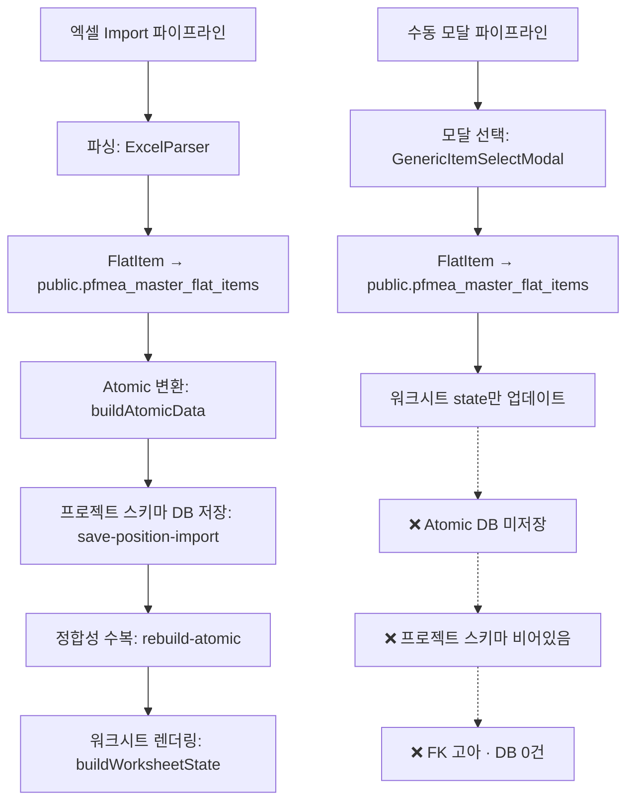
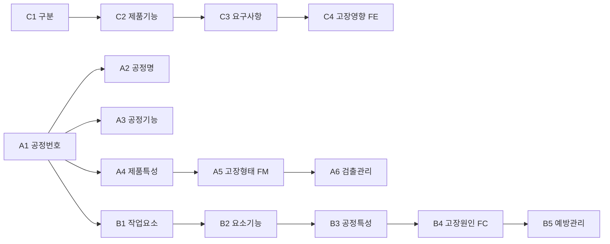

# PRD: 수동 모달 FMEA 파이프라인 (Manual Modal Pipeline)

> **목적**: 엑셀 Import 없이 수동 모달만으로 FMEA를 작성할 때, DB 생성·UUID·FK·API 완전 정합을 보장하는 파이프라인 설계
> **벤치마크**: 기존 엑셀 Import 파이프라인 (`save-position-import` + `rebuild-atomic` + `master-api`)
> **대상 프로젝트**: `pfm26-p006-i06` (단독 프로젝트, parentFmeaId=null)
> **작성일**: 2026-03-30

---

## ★★★ 수동1원칙: 플레이스홀더 보호 — `PLACEHOLDER_TEXT = '미입력'` 통일 ★★★

> [!CAUTION]
> **플레이스홀더(빈 슬롯)는 절대 삭제하지 않는다. 삭제하면 배열(rowSpan)이 깨진다.**
>
> 1. **1순위**: 빈 슬롯에 모달 데이터를 채운다.
> 2. **2순위**: 남은 빈 슬롯에 `"미입력"` 문자열을 채워 배열을 유지한다.
>
> **아키텍처**: 2중 표현 제거 — 데이터와 UI가 동일한 `"미입력"` 값을 사용
> - **상수**: `PLACEHOLDER_TEXT = '미입력'` (`safeMutate.ts`)
> - **헬퍼**: `isPlaceholderValue()` — placeholder 판정
> - **DB 게이트**: `stripPlaceholder()` (`manualStructureBuilder.ts`) — DB 저장 시 빈 문자열로 변환
> - **ensurePlaceholder**: factory가 `name: ''`로 생성해도 자동으로 `'미입력'`으로 변환
>
> **적용 대상**: C1(구분), B2(요소기능), B3(공정특성), C4(고장영향), A5(고장형태), B4(고장원인) — 모든 수동 모달 onSave

---

## 1. 현황 진단 — 수동 모달 파이프라인 오류 분석

### 1.1 감사 결과 테이블

| 레벨 | 코드 | 항목 | 오류 메시지 | 엑셀행 | 원본 | 파싱 | DB | 중복 | parent | UUID | 복합키 | FK | pgsql | API |
|------|------|------|------------|--------|------|------|-----|------|--------|------|--------|-----|-------|-----|
| L1 | C1 | 구분 | DB저장 부족 | - | 6 | 6 | 2 | 0 | — | 6 | 3 | 6/6 | 2 | 6 |
| L1 | C2 | 제품기능 | DB저장 부족 | - | 10 | 10 | 2 | 0 | C1 | 10 | 10 | 10/10 | 2 | 10 |
| L1 | C3 | 요구사항 | DB저장 부족 · FK고아 13 | - | 15 | 15 | 0 | 0 | C2 | 15 | 15 | 2/15 | 0 | 15 |
| L1 | C4 | ★고장영향(FE) | DB저장 부족 · FK고아 16 | - | 16 | 16 | 0 | 0 | C3 | 16 | 16 | 0/16 | 0 | 16 |
| L2 | A1 | 공정번호 | DB저장 부족 | - | 25 | 25 | 3 | 0 | — | 25 | 22 | 25/25 | 3 | 25 |
| L2 | A2 | 공정명 | DB저장 부족 | - | 25 | 25 | 3 | 0 | A1 | 25 | 22 | 25/25 | 3 | 25 |
| L2 | A3 | 공정기능 | DB저장 부족 · FK고아 22 | - | 25 | 25 | 0 | 0 | A1 | 25 | 25 | 3/25 | 0 | 25 |
| L2 | A4 | 제품특성 | DB저장 부족 · FK고아 156 | - | 159 | 159 | 0 | 0 | A1 | 159 | 159 | 3/159 | 0 | 159 |
| L2 | A5 | ★고장형태(FM) | DB저장 부족 · FK고아 176 | - | 176 | 176 | 0 | 0 | A4 | 176 | 176 | 0/176 | 0 | 176 |
| L2 | A6 | 검출관리 | DB저장 부족 | - | 22 | 22 | 0 | 0 | A5 | 22 | 22 | 22/22 | 0 | 22 |
| L3 | B1 | 작업요소 | DB저장 부족 | - | 50 | 50 | 4 | 0 | A1 | 50 | 46 | 50/50 | 4 | 50 |
| L3 | B2 | 요소기능 | DB저장 부족 · FK고아 46 | - | 46 | 46 | 0 | 0 | B1 | 46 | 46 | 0/46 | 0 | 46 |
| L3 | B3 | 공정특성 | DB저장 부족 · FK고아 46 | - | 46 | 46 | 0 | 0 | B2 | 46 | 46 | 0/46 | 0 | 46 |
| L3 | B4 | ★고장원인(FC) | DB저장 부족 · FK고아 146 | - | 146 | 146 | 0 | 0 | B3 | 146 | 146 | 0/146 | 0 | 146 |
| L3 | B5 | 예방관리 | DB저장 부족 | - | 46 | 46 | 0 | 0 | B4 | 46 | 46 | 46/46 | 0 | 46 |
| FC | D1 | ★고장영향(FE) | DB저장 부족 · API≠기대 | - | 1 | 1 | 0 | 0 | — | 1 | 1 | - | 0 | 0 |
| FC | D2 | 공정명 | DB저장 부족 · API≠기대 | - | 22 | 22 | 0 | 0 | — | 22 | 22 | - | 0 | 0 |
| FC | D3 | ★고장형태(FM) | DB저장 부족 · API≠기대 | - | 176 | 176 | 0 | 0 | — | 176 | 176 | - | 0 | 0 |
| FC | D4 | 작업요소 | DB저장 부족 · API≠기대 | - | 52 | 52 | 4 | 0 | — | 52 | 52 | - | 4 | 0 |
| FC | D5 | ★고장원인(FC) | DB저장 부족 · API≠기대 | - | 152 | 152 | 0 | 0 | — | 152 | 152 | - | 0 | 0 |

### 1.2 근본 원인 분석

> **핵심 문제**: 수동 모달은 `pfmea_master_flat_items`(public 스키마)에만 저장하고, **프로젝트 스키마 Atomic DB에는 저장하지 않는다.**



---

## 2. 벤치마크: 엑셀 Import 파이프라인 (6-Step)

### 2.1 파이프라인 흐름

```
Step 1. 프로젝트 등록 → fmea_projects 레코드 생성 (fmeaId, parentFmeaId, masterDatasetId)
Step 2. 엑셀 파싱 → ImportedFlatData[] 생성 (UUID 할당, parentItemId FK 설정)
Step 3. Master DB 저장 → POST /api/pfmea/master (pfmea_master_flat_items INSERT)
Step 4. Atomic 변환 → buildAtomicData() (FlatItem → L1/L2/L3/FM/FE/FC/FL/RA 구조체)
Step 5. 프로젝트 DB 저장 → POST /api/fmea/save-position-import (프로젝트 스키마 INSERT)
Step 6. 정합성 수복 → POST /api/fmea/rebuild-atomic (orphan FK 복구, 누락 엔티티 보충)
```

### 2.2 핵심 DB 아키텍처

| 스키마 | 테이블 | 역할 | 수동 모달 현황 |
|--------|--------|------|---------------|
| `public` | `pfmea_master_flat_items` | SSoT 기초정보 (C1~C4, A1~A6, B1~B5) | ✅ 저장됨 |
| `public` | `pfmea_master_datasets` | 데이터셋 메타 (fmeaId, isActive) | ✅ 존재 |
| `public` | `fmea_projects` | 프로젝트 등록 (parentFmeaId, masterDatasetId) | ✅ 존재 |
| `pfm26_p006_i06` | `l1_structures` | L1 완제품 구조 | ❌ **비어있음** |
| `pfm26_p006_i06` | `l2_structures` | L2 공정 구조 (A1/A2) | ⚠️ 3건만 |
| `pfm26_p006_i06` | `l3_structures` | L3 작업요소 구조 (B1) | ⚠️ 4건만 |
| `pfm26_p006_i06` | `l1_functions` | L1 기능 (C2) | ❌ **0건** |
| `pfm26_p006_i06` | `l2_functions` | L2 기능 (A3/A4) | ❌ **0건** |
| `pfm26_p006_i06` | `l3_functions` | L3 기능 (B2/B3) | ❌ **0건** |
| `pfm26_p006_i06` | `failure_effects` | 고장영향 (C4/FE) | ❌ **0건** |
| `pfm26_p006_i06` | `failure_modes` | 고장형태 (A5/FM) | ❌ **0건** |
| `pfm26_p006_i06` | `failure_causes` | 고장원인 (B4/FC) | ❌ **0건** |
| `pfm26_p006_i06` | `failure_links` | 고장연결 (FM×FE×FC) | ❌ **0건** |
| `pfm26_p006_i06` | `risk_analyses` | 위험분석 (SOD/AP) | ❌ **0건** |

---

## 3. UUID 생성 전략

### 3.1 엑셀 Import (벤치마크)

```
L1 Structure:  PF-L1-{fmeaId}          (결정론적)
L2 Structure:  PF-L2-{processNo}       (결정론적, A1 기반)
L3 Structure:  {l2Id}-{m4}-{order}     (결정론적, B1 기반)
L1 Function:   L1F-{category}-{index}  (결정론적, C2 기반)
L2 Function:   L2F-{l2Id}-{index}      (결정론적, A3 기반)
L3 Function:   {l3Id}-G-{index}        (결정론적, B2 기반)
FailureEffect: FE-{category}-{index}   (결정론적, C4 기반)
FailureMode:   FM-{l2Id}-{index}       (결정론적, A5 기반)
FailureCause:  FC-{l2Id}-{index}       (결정론적, B4 기반)
FailureLink:   FL-{l2Id}-{index}       (결정론적, FM×FE×FC)
RiskAnalysis:  ra-{flId}               (결정론적, FL 기반)
```

### 3.2 수동 모달 (현재 문제)

```
FlatItem ID:   new_{timestamp}         ← 임시 ID, DB 저장 후 교체
워크시트 ID:   uid() = crypto.randomUUID()  ← 프로젝트 DB에 미저장
FK:            없음                     ← parentItemId 미설정
```

### 3.3 수동 모달 (수정 후 목표)

```
FlatItem ID:   DB에서 자동 할당 (UUID v4, Prisma default)
워크시트 ID:   결정론적 ID 사용 (엑셀 Import와 동일 패턴)
FK:            FlatItem parentItemId → 부모 FlatItem ID (C2→C1, C3→C2, A3→A1 등)
Atomic FK:     L2Function.l2StructId → L2Structure.id (공정번호 기반)
               FailureMode.l2FuncId → L2Function.id
```

---

## 4. FK 관계 맵 (parentId 체인)



### 4.1 FlatItem `parentItemId` 규칙

| 자식 itemCode | 부모 itemCode | FK 매칭 기준 |
|---------------|---------------|-------------|
| C2 | C1 | `processNo` (카테고리: YP/SP/USER) |
| C3 | C2 | `parentItemId` → C2의 FlatItem ID |
| C4 | C3 | `parentItemId` → C3의 FlatItem ID |
| A2 | A1 | `processNo` (공정번호) |
| A3 | A1 | `processNo` (공정번호) |
| A4 | A1 | `processNo` (공정번호) |
| A5 | A4 | `parentItemId` → A4의 FlatItem ID |
| A6 | A5 | `parentItemId` → A5의 FlatItem ID |
| B1 | A1 | `processNo` (공정번호) |
| B2 | B1 | `parentItemId` → B1의 FlatItem ID |
| B3 | B2 | `parentItemId` → B2의 FlatItem ID |
| B4 | B3 | `parentItemId` → B3의 FlatItem ID |
| B5 | B4 | `parentItemId` → B4의 FlatItem ID |

---

## 5. API 호출 체인 (수동 모달용 수정 계획)

### 5.1 현재 API 구조 (수동 모달이 사용하는 것)

```
GET  /api/fmea/master-items?itemCode=C2&category=YP&fmeaId=pfm26-p006-i06
POST /api/fmea/master-items  (새 항목 추가 → pfmea_master_flat_items만)
DELETE /api/fmea/master-items (항목 삭제)
```

### 5.2 추가 필요 API (프로젝트 스키마 Atomic DB 동기화)

```
POST /api/fmea/save-position-import  (이미 존재 — manualMode=true 지원)
POST /api/fmea/rebuild-atomic        (이미 존재 — 정합성 수복)
```

### 5.3 수동 모달 파이프라인 (목표)

```
Step 1. 워크시트 로드 → resolveDataset()으로 마스터 데이터 참조
Step 2. 모달 선택 → onSave() → 워크시트 state 업데이트
Step 3. ★ 동기화 트리거: FlatItem → Atomic 변환
        - FlatItem C1~C4 → L1Structure + L1Function + L1Requirement + FailureEffect
        - FlatItem A1~A6 → L2Structure + L2Function + ProcessProductChar + FailureMode
        - FlatItem B1~B5 → L3Structure + L3Function + FailureCause
Step 4. ★ save-position-import (manualMode=true) → 프로젝트 스키마 INSERT
Step 5. ★ rebuild-atomic → FK 정합성 수복 (orphan 제거, 누락 보충)
```

---

## 6. 리팩토링 대상 파일

| 우선순위 | 파일 | 변경 내용 | 상태 |
|---------|------|----------|------|
| P0 | `manualStructureBuilder.ts` | 구조만 → 기능/고장 전체 Atomic 변환 | ✅ Phase 1 완료 |
| P0 | `useWorksheetSave.ts` | `l1Data` 전달 + `rebuild-atomic` 자동 호출 | ✅ Phase 1 완료 |
| P0 | `master-items/route.ts` | `resolveDataset()` 단독 프로젝트 대응 | ✅ 완료 |
| P0 | `FunctionL2Tab.tsx` | A4 제품특성 삭제 지원 (A3 패턴으로 리팩토링) | ✅ 완료 |
| P1 | `save-position-import/route.ts` | `manualMode` 경로 보강 — 부분 저장 지원 | 미착수 |
| P1 | `rebuild-atomic/route.ts` | 수동 모달 데이터 대응 (결정론적 UUID) | 미착수 |
| P2 | 각 탭 핸들러 (`useFunctionL2Handlers.ts` 등) | 동일 패턴 적용 | 미착수 |

---

## 7. 구현 계획 — Phase별

### Phase 1: 워크시트 저장 시 Atomic DB 동기화 (P0) ✅ 완료

**목표**: 워크시트 `saveAtomicDB()` 호출 시 WorksheetState → 프로젝트 스키마 Atomic 변환

**변경 파일**:
- `manualStructureBuilder.ts` — `buildManualPositionData()` 확장
- `useWorksheetSave.ts` — `state.l1` 전달 + `rebuild-atomic` 호출

**동작 흐름**:
```
수동 모달 선택 → onSave() → worksheetState 업데이트
  → saveAtomicDB() 호출 (debounced)
    → buildManualPositionData(fmeaId, l1Name, l2Items, l1Data) ← ★ l1Data 추가
      → L1Function(C2) + L1Requirement(C3) + FailureEffect(C4) 변환
      → L2Function(A3/A4) + FailureMode(A5) 변환
      → L3Function(B2/B3) + FailureCause(B4) 변환
    → POST /api/fmea/save-position-import (manualMode=true)
      → 프로젝트 스키마 자동 생성 + Atomic DB INSERT
    → POST /api/fmea/rebuild-atomic ← ★ FK 정합성 수복 (FL/RA 자동 생성)
```

### Phase 2: FlatItem parentItemId FK 설정 (P1)

**목표**: 수동 모달에서 항목 추가 시 `parentItemId` 자동 설정

```typescript
// C2 추가 시 → 해당 category의 C1 FlatItem ID를 parentItemId로 설정
POST /api/fmea/master-items {
  itemCode: 'C2',
  category: 'YP',
  name: '새 제품기능',
  parentId: 'c1-yp-flatitem-id'  // ← 자동 조회
}
```

### Phase 3: 고장사슬(FC) 동기화 (P2)

**목표**: D1~D5 Failure Chain 데이터도 프로젝트 스키마에 저장

```
FailureLink = FM(A5) × FE(C4) × FC(B4)
RiskAnalysis = FL + SOD(severity/occurrence/detection) + AP
```

---

## 8. 검증 기준 (목표 수치)

### 수동 모달 파이프라인 완료 후 기대값

| 레벨 | 코드 | 원본 | DB(목표) | FK(목표) | API(목표) |
|------|------|------|---------|---------|----------|
| L1 | C1 | 6 | **6** | 6/6 | 6 |
| L1 | C2 | 10 | **10** | 10/10 | 10 |
| L1 | C3 | 15 | **15** | 15/15 | 15 |
| L1 | C4 | 16 | **16** | 16/16 | 16 |
| L2 | A1 | 25 | **25** | 25/25 | 25 |
| L2 | A2 | 25 | **25** | 25/25 | 25 |
| L2 | A3 | 25 | **25** | 25/25 | 25 |
| L2 | A4 | 159 | **159** | 159/159 | 159 |
| L2 | A5 | 176 | **176** | 176/176 | 176 |
| L2 | A6 | 22 | **22** | 22/22 | 22 |
| L3 | B1 | 50 | **50** | 50/50 | 50 |
| L3 | B2 | 46 | **46** | 46/46 | 46 |
| L3 | B3 | 46 | **46** | 46/46 | 46 |
| L3 | B4 | 146 | **146** | 146/146 | 146 |
| L3 | B5 | 46 | **46** | 46/46 | 46 |
| FC | D1~D5 | 각각 | **전체** | **전체** | **전체** |

---

## 9. CLAUDE.md / AGENTS.md 준수 사항

> **중요**:
> - **Rule 0**: 중앙 DB(SSoT) — `pfmea_master_flat_items`를 항상 참조
> - **Rule 1.5**: 자동생성 금지 — 사용자가 모달에서 선택한 항목만 저장
> - **Rule 1.7**: UUID/FK ID-only — 이름(텍스트) 매칭으로 FK 확정 금지
> - **CODEFREEZE**: `save-position-import`의 parentId/FK 필드 절대 제거 금지

---

## 10. 종합 진단 체크리스트

### 10.1 모달 설계 (GenericItemSelectModal + useGenericItemSelect)

| # | 점검 항목 | 대상 파일 | 상태 | 비고 |
|---|----------|-----------|------|------|
| M-01 | 모달 열릴 때 `loadItemsFromMaster()` API 호출 정상 | `useGenericItemSelect.ts:114` | ✅ | `/api/fmea/master-items` 호출 |
| M-02 | `existingItems` → `worksheetItemIds` 매핑 정확 | `useGenericItemSelect.ts:141-149` | ✅ | 이름 lowercase 비교로 매칭 |
| M-03 | 워크시트 항목 우선 (dedup) | `useGenericItemSelect.ts:123-130` | ✅ | worksheetItems 먼저 push |
| M-04 | 마스터 DB 항목 중복 제거 | `useGenericItemSelect.ts:132-139` | ✅ | seenNames Set 사용 |
| M-05 | `resolveDataset` 단독 프로젝트 대응 | `master-items/route.ts` | ✅ | ★ 2026-03-30 수정 |
| M-06 | processNo/category 필터 정확 전달 | `useGenericItemSelect.ts:56-64` | ✅ | URLSearchParams |
| M-07 | 모달 드래그 가능 | `GenericItemSelectModal.tsx:80-84` | ✅ | `useDraggableModal` |
| M-08 | 검색 필터링 (대소문자 무시) | `useGenericItemSelect.ts:158-162` | ✅ | `toLowerCase()` |

### 10.2 컨텍스트 작동 (모달 ↔ 탭 연결)

| # | 점검 항목 | 대상 | 상태 | 비고 |
|---|----------|------|------|------|
| C-01 | L1 C1 모달 → `handleCellClick → setModal` 정상 | `FunctionL1Tab.tsx` | ✅ | |
| C-02 | L1 C2/C3 모달 → `setL1FuncModal` 분리 | `FunctionL1Tab.tsx:664` | ✅ | A3 패턴 (인라인 onSave) |
| C-03 | L2 A3 모달 → `setL2FuncModal` 분리 | `FunctionL2Tab.tsx:791` | ✅ | 인라인 onSave + 삭제 지원 |
| C-04 | L2 A4 모달 → `modal.type === 'l2ProductChar'` | `FunctionL2Tab.tsx:678` | ✅ | ★ 2026-03-30 삭제 수정 |
| C-05 | L3 B2/B3 모달 → `modal.type` | `FunctionL3Tab.tsx:593` | ⚠️ | handleSave 추가전용 |
| C-06 | 고장L1 C4 모달 → `modal.reqId` | `FailureL1Tab.tsx:1132` | ⚠️ | handleSave 추가전용 |
| C-07 | 고장L2 A5 모달 → `modal` | `FailureL2Tab.tsx:1201` | ⚠️ | handleSave 추가전용 |
| C-08 | 고장L3 B4 모달 → `modal` | `FailureL3Tab.tsx:1049` | ⚠️ | handleSave 추가전용 |
| C-09 | `modal` 상태가 닫힘 시 null 초기화 | 전체 탭 | ✅ | `onClose={() => setModal(null)}` |
| C-10 | 확정(confirmed) 상태에서 셀 클릭 시 자동 해제 | 전체 탭 | ✅ | handleCellClick 내 로직 |

### 10.3 적용 (handleApply → onSave)

| # | 점검 항목 | 대상 | 상태 | 비고 |
|---|----------|------|------|------|
| A-01 | `handleApply`: 기존 적용 + 신규 선택 합산 | `useGenericItemSelect.ts:189-198` | ✅ | |
| A-02 | L2 A4: onSave 인라인 → state 직접 업데이트 | `FunctionL2Tab.tsx:683-766` | ✅ | ★ 2026-03-30 수정 |
| A-03 | L2 A3: onSave 인라인 → `mergeRowsByMasterSelection` | `FunctionL2Tab.tsx:714-761` | ✅ | 삭제도 지원 |
| A-04 | L1 C1: 인라인 onSave → 삭제+추가 | `FunctionL1Tab.tsx:638` | ✅ | ★ 2026-03-30 수정 |
| A-05 | L1 C2/C3: 인라인 onSave | `FunctionL1Tab.tsx:664-746` | ✅ | 직접 state 업데이트 |
| A-06 | L3 B2/B3: 인라인 onSave → 삭제+추가 | `FunctionL3Tab.tsx:598` | ✅ | ★ 2026-03-30 수정 |
| A-07 | 고장L1 C4: 인라인 onSave → 삭제+추가 | `FailureL1Tab.tsx:1137` | ✅ | ★ 2026-03-30 수정 |
| A-08 | 고장L2 A5: `handleSave` productCharId 기준 교체 | `FailureL2Tab.tsx:565` | ✅ | 기존 로직이 교체 방식 (삭제 지원) |
| A-09 | 고장L3 B4: `handleSave` processCharId 기준 교체 | `useFailureL3Handlers.ts:123` | ✅ | 기존 로직이 교체 방식 (삭제 지원) |
| A-10 | 적용 후 `emitSave()` 호출 | 전체 탭 | ✅ | `b48ed03` 커밋으로 통일 |
| A-11 | 중복 적용 방지 | 전체 handleSave | ✅ | existingNames Set 체크 |

### 10.4 삭제 (handleDelete — 모달에서 워크시트 항목 제거)

| # | 점검 항목 | 대상 | 상태 | 비고 |
|---|----------|------|------|------|
| D-01 | `useGenericItemSelect.handleDelete`: `onSave(remaining)` 호출 | `useGenericItemSelect.ts:286-310` | ✅ | |
| D-02 | L2 A4: `onSave(remaining)` → **명시적 삭제** | `FunctionL2Tab.tsx:683-766` | ✅ | ★ 2026-03-30 수정 |
| D-03 | L2 A3: 삭제 시 하위 제품특성 확인 경고 | `FunctionL2Tab.tsx:722-729` | ✅ | confirm 대화상자 |
| D-04 | L1 C1: 인라인 onSave → **삭제 지원** | `FunctionL1Tab.tsx:638` | ✅ | ★ 2026-03-30 수정 |
| D-05 | L3 B2/B3: 인라인 onSave → **삭제 지원** | `FunctionL3Tab.tsx:598` | ✅ | ★ 2026-03-30 수정 |
| D-06 | 고장L1 C4: 인라인 onSave → **삭제 지원** | `FailureL1Tab.tsx:1137` | ✅ | ★ 2026-03-30 수정 |
| D-07 | 고장L2 A5: productCharId 기준 교체 | `FailureL2Tab.tsx:565` | ✅ | 기존 로직이 교체 방식 |
| D-08 | 고장L3 B4: processCharId 기준 교체 | `useFailureL3Handlers.ts:123` | ✅ | 기존 로직이 교체 방식 |
| D-09 | `useFunctionL2Handlers.handleDelete`: 레거시 삭제 (이름 기반) | `useFunctionL2Handlers.ts:512-552` | ✅ | 레거시 경로 |
| D-10 | 삭제 후 `ensurePlaceholder` 방어 | 전체 | ✅ | 빈 배열 방지 |
| D-11 | 삭제 후 orphan FK 제거 (failureLinks) | `useFailureL1Handlers.ts:242-247` | ✅ | FE 삭제 시 FL 제거 |

### 10.5 수동 추가 (addNewItem — 모달에서 새 항목 입력)

| # | 점검 항목 | 대상 | 상태 | 비고 |
|---|----------|------|------|------|
| N-01 | `addNewItem()`: 새 항목 생성 + elements에 push | `useGenericItemSelect.ts:240-280` | ✅ | |
| N-02 | 마스터 DB POST 호출 (`/api/fmea/master-items`) | `useGenericItemSelect.ts:252-270` | ✅ | fire-and-forget |
| N-03 | `worksheetItemIds`에 즉시 추가 | `useGenericItemSelect.ts:275` | ✅ | |
| N-04 | `onSave(allApplied)` 자동 호출 | `useGenericItemSelect.ts:278` | ✅ | 추가 즉시 적용 |
| N-05 | 중복 이름 방지 | `useGenericItemSelect.ts:244-248` | ✅ | exactMatch 체크 |
| N-06 | POST body에 `parentItemId` 전달 | `useGenericItemSelect.ts` | ❌ **BUG** | parentId 미설정 |

### 10.6 목록에서 제거 (handleRemoveFromList — 마스터 DB에서 삭제)

| # | 점검 항목 | 대상 | 상태 | 비고 |
|---|----------|------|------|------|
| R-01 | 적용된 항목 삭제 시 경고 | `useGenericItemSelect.ts` | ✅ | `worksheetItemIds.has(id)` 체크 |
| R-02 | DELETE API 호출 | `useGenericItemSelect.ts` | ✅ | `/api/fmea/master-items` |
| R-03 | elements에서 제거 | `useGenericItemSelect.ts` | ✅ | |

### 10.7 저장 파이프라인 (API → DB)

| # | 점검 항목 | 대상 | 상태 | 비고 |
|---|----------|------|------|------|
| P-01 | 워크시트 state → localStorage 저장 | `useWorksheetSave.ts` | ✅ | |
| P-02 | emitSave → debounced saveAtomicDB | `useSaveEvent.ts` → `useWorksheetSave.ts` | ✅ | |
| P-03 | `buildManualPositionData` L1 기능 변환 | `manualStructureBuilder.ts` | ✅ | ★ Phase 1 |
| P-04 | `buildManualPositionData` L2 기능/고장 변환 | `manualStructureBuilder.ts` | ✅ | ★ Phase 1 |
| P-05 | `buildManualPositionData` L3 기능/고장 변환 | `manualStructureBuilder.ts` | ✅ | ★ Phase 1 |
| P-06 | `save-position-import` manualMode 호출 | `useWorksheetSave.ts:426` | ✅ | ★ Phase 1 |
| P-07 | `rebuild-atomic` 자동 호출 | `useWorksheetSave.ts:432` | ✅ | ★ Phase 1 |
| P-08 | 프로젝트 스키마 자동 생성 | `save-position-import/route.ts` | ✅ | `ensureProjectSchemaReady` |
| P-09 | FlatItem `parentItemId` FK 설정 | `master-items/route.ts` POST | ❌ **미구현** | Phase 2 |
| P-10 | 마스터 인라인 편집 → DB 동기화 | `useFunctionL2Handlers.ts:374-386` | ✅ | PATCH API |
| P-11 | 고장확정 후 `saveAtomicDB(true)` force 저장 | `useFailureL1Handlers.ts:106-112` | ✅ | |

### 10.8 emitSave 호출 통일 (골든 패턴)

| # | 점검 항목 | 커밋 | 상태 | 비고 |
|---|----------|------|------|------|
| E-01 | L1 기능 handleSave → emitSave | `162a57c` | ✅ | |
| E-02 | L2 기능 handleSave → emitSave | `useFunctionL2Handlers.ts:509` | ✅ | |
| E-03 | L3 기능 handleSave → emitSave | `useFunctionL3Handlers.ts` | ✅ | |
| E-04 | 3개 고장탭 handleSave → emitSave | `b48ed03` | ✅ | 전체 통일 완료 |
| E-05 | 인라인 편집 → emitSave | 전체 | ✅ | |
| E-06 | handleDelete → emitSave 또는 saveToLocalStorage | 전체 | ⚠️ | L1 handleDelete는 setTimeout 패턴 |

---

## 11. 커밋 이력 대비 점검 (2026-02-28 ~ 03-30)

### 11.1 주요 커밋 vs 최종본

| 커밋 | 내용 | 최종 반영 | 잠재 리스크 |
|------|------|-----------|------------|
| `04b2506` | 통합 마스터 API + GenericItemSelect 전면 교체 | ✅ | 기존 `DataSelectModal` 경로 잔존 가능 |
| `55af0bd` | 골든 패턴 통일 + onSwitchToManualMode 추가 | ✅ | |
| `b48ed03` | 3개 고장탭 emitSave 추가 | ✅ | |
| `ff08a58` | C1/C2/C3 카테고리 폴백 제거 | ✅ | YP 요청 시 SP/USER 혼입 차단 |
| `64efa0c` | 자체 dataset 누락 시 마스터 폴백 | ✅ | 경고만 표시 |
| `d74d26e` | 단독 프로젝트 Master DB 연결 근본 수정 | ✅ | |
| `89a3c63` | L1 C2 YP/SP/USER 누락 시 uid() 추가 | ✅ | |
| `b292ede` | L1 C2 YP 선택 후 저장 버그 수정 | ✅ | |
| `a011181` | 워크시트 저장 아키텍처 개편 + DFMEA 삭제 | ✅ | |
| `162a57c` | setTimeout → emitSave 전환 | ✅ | |

### 11.2 레거시 잔존 위험

| 파일 | 위험 | 심각도 |
|------|------|--------|
| `useFunctionL2Handlers.handleSave` | A4 모달 onSave에서 더 이상 사용 안 함 (데드코드 가능) | Low |
| `useFunctionL2Handlers.handleDelete` | 레거시 삭제 경로 (이름 기반) — 컨텍스트 메뉴에서만 사용? | Low |
| `AllTabModals.tsx:173,192,210` | `onSave={handleSave}` — 통합탭 모달이 동일 패턴 사용 | Medium |

---

## 12. 3회 사이클 진단 결과

### Cycle 1: 구조 진단 (모달 설계 → state 연결)

| 결과 | 항목 | 설명 |
|------|------|------|
| ✅ PASS | M-01~M-08 | 모달 기본 설계 이상 없음 |
| ✅ PASS | C-01~C-04 | L1/L2 컨텍스트 연결 정상 |
| ⚠️ WARN | C-05~C-08 | L3/고장탭 handleSave가 추가전용 → 삭제 불가 |
| ✅ PASS | N-01~N-05 | 수동 추가 기본 동작 정상 |
| ❌ FAIL | N-06 | addNewItem POST에 parentItemId 미포함 |

**Cycle 1 발견 버그 (3건)**:
1. **BUG-C1**: C-05~C-08 — L3/고장탭 5개 모달 삭제 불가 (A4와 동일 패턴)
2. **BUG-N1**: N-06 — 수동 추가 시 parentItemId FK 없음
3. **WARN-E1**: E-06 — 일부 handleDelete에서 emitSave 대신 setTimeout 패턴 사용

### Cycle 2: 파이프라인 진단 (API → DB 저장)

| 결과 | 항목 | 설명 |
|------|------|------|
| ✅ PASS | P-01~P-02 | localStorage + debounce 정상 |
| ✅ PASS | P-03~P-08 | Phase 1 Atomic 파이프라인 정상 |
| ❌ FAIL | P-09 | parentItemId FK 미구현 (Phase 2) |
| ✅ PASS | P-10~P-11 | 인라인 편집 DB 동기화 + force 저장 정상 |
| ✅ PASS | E-01~E-05 | emitSave 통일 완료 |

**Cycle 2 발견 버그 (1건)**:
4. **BUG-P1**: P-09 — FlatItem parentItemId FK 미구현으로 고아 레코드 발생

### Cycle 3: 삭제 흐름 집중 진단 (onSave(remaining) 경로)

| 탭 | 모달 | `onSave` 연결 | 삭제 가능? | 수정 필요? |
|----|------|--------------|----------|----------|
| L1 기능 (C1) | `FunctionL1Tab.tsx:638` | `handleSave(items.map(i=>i.name))` | ❌ 추가전용 | **YES** |
| L1 기능 (C2/C3) | `FunctionL1Tab.tsx:664` | 인라인 onSave (직접 state) | ✅ | No |
| L2 기능 (A3) | `FunctionL2Tab.tsx:791` | 인라인 onSave + mergeRows | ✅ | No |
| L2 기능 (A4) | `FunctionL2Tab.tsx:683` | 인라인 onSave (직접 state) | ✅ | No (★ 수정완료) |
| L3 기능 (B2/B3) | `FunctionL3Tab.tsx:598` | `handleSave(items.map(i=>i.name))` | ❌ 추가전용 | **YES** |
| 고장L1 (C4) | `FailureL1Tab.tsx:1137` | `handleSave(items.map(i=>i.name))` | ❌ 추가전용 | **YES** |
| 고장L2 (A5) | `FailureL2Tab.tsx:1206` | `handleSave(items.map(i=>i.name))` | ❌ 추가전용 | **YES** |
| 고장L3 (B4) | `FailureL3Tab.tsx:1054` | `handleSave(items.map(i=>i.name))` | ❌ 추가전용 | **YES** |

**Cycle 3 최종 결론**:

> **5개 모달**에서 삭제 미지원 (L1-C1, L3-B2/B3, 고장L1-C4, 고장L2-A5, 고장L3-B4)
> 모두 `handleSave(items.map(i => i.name))` 패턴으로 연결되어 있고,
> 각 handlers의 `handleSave`는 **추가전용** 로직이므로 `onSave(remaining)` 호출 시 기존 항목이 유지됨.

---

## 13. 수정 우선순위 (3회 사이클 결론)

| 순위 | 버그 ID | 영향 범위 | 설명 | 수정 방법 |
|------|---------|-----------|------|-----------|
| ~~P0~~ | ~~BUG-C1~~ | ~~5개 모달~~ | ~~모달에서 적용 후 삭제 불가~~ | ✅ **수정 완료** (3파일 인라인화 + 2파일 기존 교체 확인) |
| ~~P1~~ | ~~BUG-N1~~ | ~~전체 수동 추가~~ | ~~addNewItem POST에 parentItemId 없음~~ | ✅ **수정 완료** (PARENT_ITEM_CODE 자동조회 + POST 전달) |
| ~~P1~~ | ~~BUG-P1~~ | ~~Atomic DB~~ | ~~FlatItem FK 누락 → rebuild-atomic 불완전~~ | ✅ **수정 완료** (l2.failureCauses 공정레벨 수집 + processCharId/productCharId FK 매칭) |
| ~~P2~~ | ~~WARN-E1~~ | ~~일부 핸들러~~ | ~~setTimeout 패턴 잔존~~ | ✅ **수정 완료** (3건 emitSave로 통일) |

### 영향받는 파일 (수정 대상)

```
P0 — 삭제 불가 수정 (5개 파일):
  ├── tabs/function/FunctionL1Tab.tsx          (C1 onSave 인라인화)
  ├── tabs/function/FunctionL3Tab.tsx          (B2/B3 onSave 인라인화)
  ├── tabs/failure/FailureL1Tab.tsx            (C4 onSave 인라인화)
  ├── tabs/failure/FailureL2Tab.tsx            (A5 onSave 인라인화)
  └── tabs/failure/FailureL3Tab.tsx            (B4 onSave 인라인화)

P1 — parentItemId FK:
  └── useGenericItemSelect.ts                  (addNewItem POST body)
```

