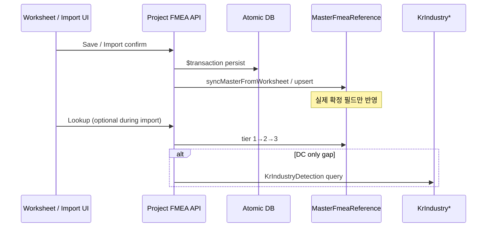

# Master FMEA Reference DB — 제품 요구사항 문서 (PRD)

| 항목 | 내용 |
|------|------|
| 문서명 | Master FMEA Reference DB PRD |
| 시스템명 | Master FMEA Reference DB (Golden Reference + Living DB) |
| 버전 | 1.0 |
| 최종 수정 | 2026-03-21 |
| 관련 원칙 | CLAUDE.md Rule 0 (중앙 DB), Rule 1.5 (UUID 중심·추론 금지) |

### 문서 독자 (Audience)

| 역할 | 활용 |
|------|------|
| 아키텍트 / 백엔드 | 스키마·API·동기화 경계 확정 |
| Import·워크시트 담당 | lookup·누락 UX·검증 KPI |
| QA / 운영 | 커버리지 리포트·시딩 회귀 |

### 전제 가정 (Assumptions)

- PostgreSQL + Prisma를 계속 사용한다.
- 프로젝트별 Atomic DB가 **1순위 SSoT**인 정책은 불변이다.
- Master는 **보충·가속**이지, Atomic을 덮어쓰는 권한 원천이 아니다.

---

## 1. 목적 (Purpose)

### 1.1 비전

**Master FMEA Reference DB**는 모든 PFMEA/DFMEA 프로젝트가 공유하는 **골든 레퍼런스(Golden Reference)** 데이터 저장소다. Import·워크시트·검증 파이프라인에서 “빈 칸을 코드로 채우기” 대신, **DB에 영속화된 실제 데이터만** 조회·참조·복제한다.

### 1.2 핵심 목표

| 목표 | 설명 |
|------|------|
| **SSoT 확장** | 프로젝트 Atomic DB 다음 순위의 공통 참조원으로 Master 테이블을 고정한다. |
| **추론/자동생성 제거** | `inferChar()`, `"${name} 부적합"`류 문자열 생성, 카테시안 추론 등 **코드 기반 데이터 창조**를 시스템 요구사항상 **금지**한다. |
| **Living DB** | 사용자 입력·Import·워크시트 저장·LLD 연계를 통해 Master가 시간에 따라 풍부해지도록 한다. |
| **매칭 가능성** | `m4`(특성 구분), `weName`(작업요소), `processNo`(공정번호) 조합으로 결정론적 lookup을 보장한다. |

### 1.3 범위 내 / 범위 외

**포함**

- Master 행 단위 reference lookup, upsert, 통계
- 산업 DB(`KrIndustry*`), LLD(`LLDFilterCode`), m002 시딩과의 **우선순위 조합**
- 누락 시 경고 코드(`M002_MISSING`) 및 UI 정책

**제외 (별도 PRD)**

- 프로젝트별 Atomic 스키마 전체 설계 (이미 중앙 DB 아키텍처 문서에 정의)
- UI 상세 와이어프레임 (본 문서는 API·데이터 정책 중심)

---

## 2. 배경 및 문제 정의 (Background)

### 2.1 현재 이슈

- Import 단계에서 텍스트 매칭·퍼지 유사도는 **추천**에는 쓸 수 있으나, **FK 확정**이나 **누락 필드 자동 채움**에 쓰이면 재현성과 감사 추적이 깨진다.
- 팀·프로젝트마다 동일한 WE/B2/B3/B4/B5 패턴이 반복되나, 공통 DB 없이 매번 파싱 결과에만 의존하면 품질 편차가 크다.

### 2.2 Master의 역할

```
[프로젝트 Atomic DB]  ← 1순위 SSoT (해당 FMEA의 확정 데이터)
        ↑
[MasterFmeaReference] ← 2순위 (공통 골든 + Living)
        ↑
[KrIndustry*, LLD, Manual] ← 3·4순위 보조
```

---

## 3. Master Data 구성 소스 (Data Sources)

### 3.1 소스 목록

| 순위 | 소스 | 설명 | 비고 |
|------|------|------|------|
| 기준 시딩 | **m002 Atomic DB** | 91 WE, 104 FC, 26 FM, 20 FE, 103 L3Function 등 **골든 레퍼런스** 규모로 Master 행을 초기 적재 | 프로젝트 ID 예: `pfm26-m002` |
| 산업 공통 | **KrIndustryDetection** | 검출관리(DC, Excel 관점 B6) 패턴 | 카테고리·키워드 기반 |
| 산업 공통 | **KrIndustryPrevention** | 예방관리(PC, B5) 패턴 | 동일 |
| 이력/필터 | **LLDFilterCode** | 과거 이력·필터 코드 기반 cross-reference | Master `sourceType = lld` 등으로 흡수 |
| 운영 입력 | **사용자 수동 입력** | 누락 보정·현장 지식 반영 | Living DB 핵심 경로 |
| 연속 학습 | **신규 FMEA 데이터** | 워크시트 저장 등 시점에 확정 데이터를 Master에 **upsert** | `syncMasterFromWorksheet()` 등 |

### 3.2 금지 사항 (Non-Goals)

- 코드 내 하드코딩 문장으로 B2~B5/A6를 **생성**하는 것
- 유사도만으로 Master 키를 **확정**하는 것 (추천 UI는 예외적으로 허용하나 FK·Master key 확정에는 사용하지 않음)

---

## 4. DB 스키마 (Schema)

### 4.1 Prisma 모델: `MasterFmeaReference`

테이블 매핑: `master_fmea_reference`

#### 4.1.1 식별 및 매칭 키 (Matching Keys)

| 필드 | 타입 | 설명 |
|------|------|------|
| `id` | `String` (UUID) | PK |
| `m4` | `String` | 특성 구분 코드: **MN | MC | IM | EN** 등 (프로젝트 표준과 일치) |
| `weName` | `String` | 작업요소명 (Work Element name) |
| `processNo` | `String` | 공정번호; 기본값 `""` — **정확 매칭 tier**에 사용 |
| `processName` | `String` | 공정명 (표시·보조 매칭·리포트) |

**Unique 제약**

```text
@@unique([m4, weName, processNo])
```

동일 `(m4, weName, processNo)`는 DB상 **한 행**만 존재한다. 공정이 다른 동일 WE명은 `processNo`로 분리한다.

#### 4.1.2 데이터 배열 필드 (Payload Arrays)

| 필드 | 타입 | 의미 (Excel/레거시 관점) |
|------|------|---------------------------|
| `b2Functions` | `String[]` | B2 요소기능 문구 목록 |
| `b3Chars` | `String[]` | B3 공정특성 |
| `b4Causes` | `String[]` | B4 고장원인(FC) |
| `b5Controls` | `String[]` | B5 예방관리(PC) |
| `a6Controls` | `String[]` | A6 검출관리(DC) — B6에 대응 |

배열은 **동일 의미의 복수 후보**를 담을 수 있으나, 값은 **실제로 DB/시트에 존재했던 문자열**에서만 채운다.

#### 4.1.3 SOD 기본값 (Default S/O/D)

| 필드 | 타입 | 설명 |
|------|------|------|
| `severity` | `Int?` | S (1–10) |
| `occurrence` | `Int?` | O (1–10) |
| `detection` | `Int?` | D (1–10) |

워크시트에서 확정·변경된 값이 Master의 대표값을 갱신할 수 있다 (정책은 §6 참조).

#### 4.1.4 메타데이터 (Metadata)

| 필드 | 타입 | 설명 |
|------|------|------|
| `sourceProject` | `String` | 유래 프로젝트 ID (기본 예: `pfm26-m002`) |
| `sourceType` | `String` | `m002` \| `import` \| `manual` \| `lld` \| `industry` 등 |
| `usageCount` | `Int` | lookup/적용 횟수 — 운영 분석·추천 가중치 |
| `lastUsedAt` | `DateTime?` | 마지막 조회·적용 시각 |
| `isActive` | `Boolean` | 비활성화 시 lookup에서 제외 |
| `createdAt` / `updatedAt` | `DateTime` | 감사용 |

#### 4.1.5 인덱스

- `m4`, `weName`, `(processNo, processName)`, `sourceType`, `usageCount` — 조회·리포트 성능용

---

## 5. API 설계 (API Design)

> 경로는 **설계 기준**이다. 구현 시 Next.js App Router 규칙에 맞춰 `src/app/api/.../route.ts`로 배치하며, 보안·검증 패턴은 기존 FMEA API(`isValidFmeaId`, `safeErrorMessage` 등)와 통일한다.

### 5.1 `GET /api/master/lookup`

**목적**: 주어진 키로 Master 레코드를 조회하고, **3-tier 매칭** 결과를 반환한다.

**Query 예시**

```http
GET /api/master/lookup?m4=MC&we=Cu%20Target&processNo=10&processName=...
```

**권장 파라미터**

| 파라미터 | 필수 | 설명 |
|----------|------|------|
| `m4` | 권장 | MN/MC/IM/EN |
| `we` | 권장 | `weName` |
| `processNo` | 선택 | 있으면 tier 1 우선 |
| `processName` | 선택 | 보조 |

**응답 (개념)**

- `matchTier`: `1` \| `2` \| `3` \| `null`
- `record`: 매칭된 `MasterFmeaReference` (또는 병합 뷰)
- `sourcesTried`: 디버그/감사용 (운영에서는 축약 가능)

### 5.2 `POST /api/master/upsert`

**목적**: 워크시트 저장·Import 확정·수동 마스터 편집 시 Master를 갱신한다.

**Body (개념)**

```json
{
  "m4": "MC",
  "weName": "Cu Target",
  "processNo": "10",
  "processName": "…",
  "b2Functions": [],
  "b3Chars": [],
  "b4Causes": [],
  "b5Controls": [],
  "a6Controls": [],
  "severity": 8,
  "occurrence": 4,
  "detection": 3,
  "sourceProject": "pfm26-xxxx",
  "sourceType": "import"
}
```

**동작**

- `@@unique([m4, weName, processNo])` 기준 **upsert**
- 배열 필드 병합 정책(덮어쓰기 vs union)은 구현 시 명세화하되, **항상 실제 입력·Atomic에서 온 값만** 반영

### 5.3 `GET /api/master/stats`

**목적**: Master **커버리지** 및 운영 지표를 반환한다.

**지표 예시**

- 전체 활성 행 수 (`isActive = true`)
- `sourceType`별 건수
- `usageCount` 상위 N
- 프로젝트별 기여도 (`sourceProject`)
- (외부 집계와 결합 시) **매칭 성공 WE / 전체 WE** 비율 — §8

---

## 6. 매칭 우선순위 (3-Tier Matching)

Lookup 시 아래 순서로 시도하고, **최초 성공** 시 해당 tier를 반환한다. 모두 실패 시 누락 처리로 이어진다 (§7).

| Tier | 조건 | 설명 |
|------|------|------|
| **1순위** | `processNo` + `m4` + `weName` | 동일 공정·동일 특성구분·동일 WE — **정확 매칭** |
| **2순위** | `m4` + `weName` (`processNo` 무시 또는 빈 값 매칭) | **크로스 공정**에서 반복되는 WE 패턴 재사용 |
| **3순위** | `m4` **카테고리 대표** | 동일 `m4`에 대해 `usageCount`·최근성·시딩 우선순위로 선택된 **대표 행** (구현 시 명확한 tie-break 규칙 필요) |

**원칙**

- Tier 간에도 **코드가 문장을 새로 쓰지 않는다**. 오직 DB에 있는 행을 고른다.
- `isActive = false` 행은 후보에서 제외한다.

### 6.1 결정론적 Tie-Break (Tier 3)

Tier 3에서 동일 `m4`에 후보가 다수일 때 아래 순서로 **하나**를 선택한다 (코드가 임의 문장을 생성하지 않음).

1. `isActive = true`
2. `sourceType = m002` 우선 (골든 시딩)
3. `usageCount` 내림차순
4. `lastUsedAt` 최신
5. `updatedAt` 최신
6. 동률 시 `id` 사전순 (완전 결정론)

---

## 7. Living DB 동기화 흐름 (Synchronization)

### 7.1 이벤트 → 동작 매핑

| 이벤트 | Master 동작 | 비고 |
|--------|-------------|------|
| **Import 완료** | 확정된 B2/B3/B4/B5/A6 및 키 필드에 대해 upsert | Staging만 반영 금지 — 사용자 확정 후 |
| **SOD 등급 변경** | 해당 (m4, we, processNo) 식별자로 연결된 Master의 S/O/D 갱신 | 프로젝트 Atomic이 진실이면, Master는 “대표값” 역할 |
| **LLD Import** | LLD와 Master 간 **cross-reference** (`sourceType = lld`, 관련 ID/코드는 별도 테이블 확장 가능) | 본 PRD 1.0은 정책 정의; 상세 스키마는 확장 항목 |
| **사용자 수동 입력** | 즉시 Master upsert | Living DB의 핵심 |
| **워크시트 저장** | `syncMasterFromWorksheet()` 호출 | 확정 워크시트 스냅샷에서만 |

### 7.2 트랜잭션·일관성

- Master upsert는 가능한 한 **프로젝트 저장 트랜잭션과 동일 커밋 경계** 또는 직후 **보상 트랜잭션**으로 설계하여, Atomic만 갱신되고 Master가 낙후하는 상태를 최소화한다.
- 실패 시 **empty catch 금지**; 로그 + 사용자 알림 정책은 기존 FMEA 규칙 준수.

### 7.3 시퀀스 다이어그램 (개념)



### 7.4 기존 코드베이스와의 정렬 (Alignment)

| 구성요소 | 역할 |
|----------|------|
| `src/app/api/pfmea/master/*` | PFMEA 마스터 JSON·동기화 등 **기존** 마스터 API — 본 PRD의 `/api/master/*`와 **네임스페이스 통합** 또는 프록시 전략을 구현 단계에서 선택 |
| `syncMasterFromWorksheet()` (개념 함수명) | 워크시트 저장 훅에서 Master upsert 호출 |
| `export-master` | 마스터 JSON 산출물과 Master 테이블은 **상호 보완**; 단일 SSoT는 테이블 + Atomic |

---

## 8. 누락 데이터 처리 (Missing Data)

### 8.1 흐름

```
DB 조회 (프로젝트 Atomic → Master → 산업 → LLD)
        ↓ 실패
경고 코드: M002_MISSING (또는 범용 MISSING_MASTER)
        ↓
Import / FC 검증 UI에 경고 표시
        ↓
사용자 선택: "입력" | "삭제" | (무응답)
```

| 선택 | 동작 |
|------|------|
| **입력** | 사용자가 실제 문구/SOD를 입력 → 해당 값으로 Master·프로젝트에 저장 (Living DB 성장) |
| **삭제** | 해당 하위 요소 제거 정책에 따라 정리 |
| **무응답** | **하위 요소가 없는 상위 B1~B5**에 대해 **cascade 삭제** 규칙 적용 (구체 규칙은 구현 체크리스트에 표준화) |

#### 8.1.1 Cascade 삭제 정책 (요약)

- **원칙**: 빈 껍데기 상위 구조(B1~B5 범위에서 정의된 “행”)만 남기지 않는다.
- **트리거**: `M002_MISSING`에 대해 사용자가 삭제를 선택하거나, 타임아웃·배치 정리 정책으로 무응답이 확정된 경우.
- **순서**: 하위부터 상위로 (예: B4→B3 연쇄가 비면 B2/WE 정리 여부는 프로젝트 규칙에 따름) — 상세는 `import-validation` 규칙과 충돌하지 않게 조정.
- **금지**: cascade로 **타 사용자 확정 데이터**를 무분별 삭제하지 않도록, 스코프는 **현재 Import 세션 또는 현재 사용자 잠금 단위**로 한정.

### 8.2 B6 (DC) 보충

- **B6(DC)**는 우선 **산업 DB (`KrIndustryDetection`)**에서 조회하여 보충한다.
- 산업 DB에도 없으면 동일하게 누락 경고 + 사용자 입력 루트로 유도한다.

### 8.3 경고 코드 (Warning Codes)

| 코드 | 의미 | 권장 HTTP/UI |
|------|------|----------------|
| `M002_MISSING` | 골든/ Master / 허용 소스에서 필수 필드를 채울 수 없음 | 404 또는 200 + `warnings[]` |
| `INDUSTRY_DC_MISS` | `KrIndustryDetection` 미매칭 (선택적 세분화) | 동일 |
| `INDUSTRY_PC_MISS` | `KrIndustryPrevention` 미매칭 | 동일 |

클라이언트는 동일 코드에 대해 동일 UX 분기(입력/삭제)를 유지한다.

---

## 9. 검증 기준 (Acceptance / KPI)

### 9.1 Master 커버리지율

```text
Master 커버리지율 = (lookup tier 1~3 성공한 WE 수) / (전체 WE 수)
```

- 집계 단위: 프로젝트 또는 전사 (리포트 목적에 따라 정의)
- **목표**: m002 기준 시딩 및 동기화 완료 후 **100%** 커버리지 (골든 베이스라인과 일치)

### 9.2 누락 경고 리포트

- 기간별 `M002_MISSING` (또는 통합 MISSING) 발생 건수
- `m4` / `processNo` / `weName` 히트맵
- 조치 결과(입력·삭제) 비율

### 9.3 회귀 검증 (기존 파이프라인과의 정합)

- `pipeline-verify`, `import-validation`, `rebuild-atomic` 등 기존 API와 병행 시 **신규 ERROR 0건** 유지
- Master lookup이 **기존 Import 결과 건수(A1~C4, FM/FC/Link)**를 깨뜨리지 않을 것

### 9.4 샘플 집계 쿼리 (운영)

```sql
-- 활성 Master 행 수 (Prisma @@map 기준)
SELECT COUNT(*) FROM master_fmea_reference WHERE "isActive" = true;

-- sourceType 분포
SELECT "sourceType", COUNT(*) FROM master_fmea_reference GROUP BY 1;
```

실제 운영은 Prisma `groupBy` 또는 전용 stats API로 대체한다.

---

## 10. 비기능 요구사항 (NFR)

| 영역 | 요구 |
|------|------|
| **성능** | lookup은 p95 200ms 이하(단일 인스턴스·로컬 DB 기준 목표); 인덱스 활용 필수 |
| **보안** | API 입력 검증, 내부망 가정하더라도 ID 노출 최소화 |
| **감사** | `sourceType`, `sourceProject`, `updatedAt`으로 출처 추적 가능 |
| **확장성** | 배열 필드 외 JSON blob 남발 금지; 필요 시 정규화 테이블로 분리하는 후속 PRD 검토 |

---

## 10.1 데이터 품질 규칙 (Data Quality)

| 규칙 ID | 설명 |
|---------|------|
| DQ-01 | 배열 요소는 trim 후 빈 문자열 저장 금지 |
| DQ-02 | 동일 `(m4, weName, processNo)` 중복 행 불가 (DB unique 보장) |
| DQ-03 | `sourceType`은 허용 enum 집합만 저장 (애플리케이션 레벨 검증) |
| DQ-04 | SOD는 1–10 범위 또는 NULL |
| DQ-05 | Tier 매칭 로그(최소한 tier 번호)를 감사 로그 또는 디버그 플래그로 남길 수 있어야 함 |

---

## 11. 마이그레이션 및 시딩 (Rollout)

1. Prisma migration으로 `master_fmea_reference` 테이블 생성 (이미 모델 존재 시 스키마 동기화).
2. m002 Atomic 스냅샷에서 배치 시딩 스크립트 실행 → 골든 레퍼런스 적재.
3. `GET /api/master/stats`로 시딩 건수 검증.
4. Import 파이프라인에 lookup hook 연결 (기능 플래그 권장).
5. 커버리지 100% 달성 후 경고 정책을 엄격 모드로 전환.

---

## 12. 용어 (Glossary)

| 용어 | 설명 |
|------|------|
| **WE** | Work Element, 작업요소 (B1 계열) |
| **m4** | 제품/공정 특성 구분 코드 (MN/MC/IM/EN 등) |
| **SOD** | Severity / Occurrence / Detection |
| **DC / PC** | Detection Control / Prevention Control |
| **Living DB** | 운영 중 지속적으로 upsert되는 Master |
| **Golden Reference** | m002 등 검증된 기준 데이터 집합 |

---

## 부록 A. API 응답 예시 (Appendix)

### `GET /api/master/lookup` — 성공 (Tier 1)

```json
{
  "ok": true,
  "matchTier": 1,
  "key": { "m4": "MC", "weName": "Cu Target", "processNo": "10" },
  "record": {
    "b2Functions": ["…"],
    "b3Chars": ["…"],
    "b4Causes": ["…"],
    "b5Controls": ["…"],
    "a6Controls": ["…"],
    "severity": 8,
    "occurrence": 4,
    "detection": 3,
    "sourceType": "m002",
    "sourceProject": "pfm26-m002"
  }
}
```

### `GET /api/master/lookup` — 누락

```json
{
  "ok": false,
  "matchTier": null,
  "warnings": [{ "code": "M002_MISSING", "message": "No master row for given keys" }]
}
```

### `GET /api/master/stats` — 요약

```json
{
  "activeRows": 1200,
  "bySourceType": { "m002": 400, "import": 500, "manual": 200, "lld": 80, "industry": 20 },
  "coverage": { "projectId": "pfm26-m002", "matchedWe": 91, "totalWe": 91, "rate": 1.0 }
}
```

---

## 13. 참조 문서 (References)

- `CLAUDE.md` — Rule 0, Rule 1.5, Master DB 지속 발전 원칙
- `prisma/schema.prisma` — `MasterFmeaReference`, `KrIndustryDetection`, `KrIndustryPrevention`
- `docs/CENTRAL_DB_ARCHITECTURE.md` (존재 시) — 중앙 DB와 Master의 관계

---

## 14. 개정 이력 (Revision History)

| 버전 | 일자 | 내용 |
|------|------|------|
| 1.0 | 2026-03-21 | 초안 작성 — 목적, 소스, 스키마, API, 매칭, 동기화, 누락, KPI |

---

## 15. 오픈 이슈 (Open Items — 구현 스프린트에서 해소)

| ID | 주제 | 비고 |
|----|------|------|
| OI-01 | 배열 필드 upsert 시 **union vs replace** 정책 | 충돌 시 사용자 확인이 필요한지 |
| OI-02 | LLD → Master **cross-reference** 전용 조인 테이블 여부 | `MasterFmeaReference`만으로 FK 추적이 부족하면 확장 |
| OI-03 | `/api/master/*` vs 기존 `pfmea/master` **라우트 통합** 일정 | 프록시·리다이렉트·deprecated 헤더 |
| OI-04 | Tier 2 매칭 시 **동일 m4+we에 processNo가 여러 행** 존재하는 비정상 데이터 정리 배치 | DQ-02와 연계 |

---

## 16. 리스크 요약 (Risks)

| 리스크 | 완화 |
|--------|------|
| Master가 오염된 텍스트로 채워져 타 프로젝트에 전파 | `sourceType`·감사 필드 + 운영 리뷰 + 비활성화(`isActive`) |
| Lookup이 Import 지연을 유발 | 인덱스·캐시·배치 preload |
| Tier 3 남용으로 부정확한 기본값 고정 | Tier 3 사용 시 UI에 “대표값” 경고 배지 |

---

*본 문서는 구현 세부 알고리즘(배열 merge 규칙, tier 3 대표 행 선정 쿼리 등)을 일부 구현 단계로 남기되, 제품 요구사항과 데이터 원칙을 고정하기 위해 작성되었다.*
